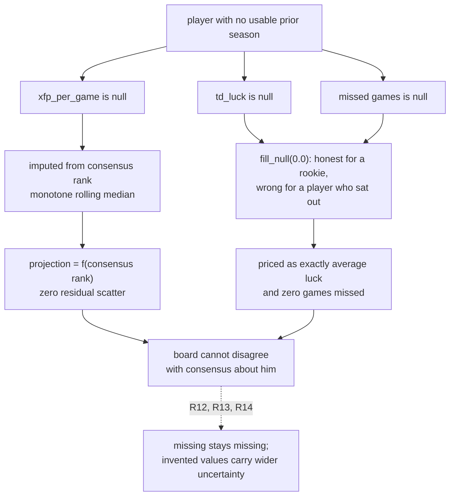
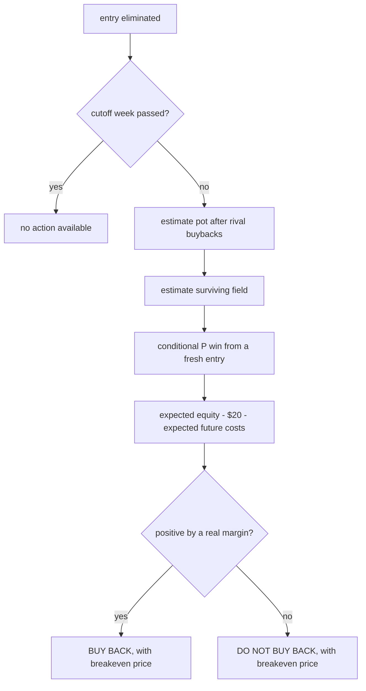

# Survivor money layer and board realism

## Summary

Extend `src/hub/season/survivor.py` to the pool that actually exists — two-team weeks, a
no-repeat ledger, and an expected-dollar objective on top of the survival objective it
already solves. Repair the draft board so a player with no usable prior season stops being
handed his own consensus rank back with a durability bonus attached. Add a decision ledger
so both are gradeable in April instead of arguable.

---

## Problem Frame

Two failures, unrelated in mechanism, identical in shape: a model that cannot be wrong
because it is quietly agreeing with its own input.

**The board.** Marshawn Lloyd's projection looks off, and it is not a tuning problem. A
player missing `xfp_per_game` has it imputed by interpolating a monotone-declining rolling
median in consensus rank, so his projection is a deterministic transform of the number the
board is supposed to improve on. `prior_signal.join_by_player` states the invariant plainly
— "a player with no prior season keeps a null, never a zero... filling one with the other
would quietly call every rookie durable and every rookie lucky" — and `priced()` then does
`fill_null(0.0)`. That fill is harmless on its own: a null yields a zero correction, which is
the honest answer when nothing is known. The damage is upstream of it. The prior-season signal
is built from player stats, which hold a row only for players who recorded something, so a null
means either a rookie who was never in the league or a rostered veteran who played zero games.
Those earn opposite treatment — no markdown for the first, a full season of missed games for
the second — and the board cannot currently tell them apart. Imputed players also sit exactly on the
curve with no residual scatter while `TALENT_CV` adds a veteran's dispersion on top, so a
rookie and a five-year starter at the same rank carry identical uncertainty. This is every
returning-from-injury player and half an early board.

**The pool.** There is $20 in a 21-entry winner-take-all survivor pool with a $420 opening
pot, buybacks at $20, no team reuse across a 24-pick season, and two-team weeks from Week 13.
`survivor.py` solves a good version of a different problem: one team per week, maximising
survival, with no money in the objective and no representation of the other twenty entries.
The gap that matters first is not the double-pick solver — it is that the moment the entry is
eliminated, the decision is a $20 investment with a computable expected value and nothing
computes it.

Neither is a modelling frontier. Both are cases where the code already contains the right
reasoning somewhere and does not apply it where it counts.

---

## Key Decisions

**Build in season order, not build-plan order.** Buyback EV has a live trigger the moment
Week 1 resolves; the double-pick solver is not exercised until Week 13. Board realism affects
in-season valuations and next August, since the draft has already run. The sequence follows
the calendar rather than a V0-to-V5 architecture.

**The field is chalk against a used-team ledger, sampled rather than deterministic.** Every
rival is modelled as picking among the teams it has not used, weighted toward the best
available. Sampling is not a refinement — it is required. Twenty-one rivals following an
identical deterministic rule against identical empty ledgers pick the identical team every week
and die in the same week, so the field never partially thins and the buyback figure loses the
quantity it is priced against. Weighted sampling keeps eliminations correlated, which is what
drives when the pool ends, while letting ledgers actually diverge — and it still models no
individual's psychology. With Hidden Picks enabled this is not a placeholder for something
better: no live ownership is ever observable at decision time.

**Auto-pick is the incumbent, not the null.** The pool assigns the best available spread team
to anyone who misses the deadline. That is the free option every recommendation must beat,
and it is the comparison `docs/method.md` rule 5 requires: gate against the simplest thing
that already works, not against nothing.

**Beating a posted price is tabled, and instrumented instead.** There is no record to point
at, `MARGIN_SD` is independently corroborated, and both `CONTEXT.md` and the repo's own audit
treat the betting market as efficient. A season of logged closing-line data answers the
question far more cheaply than a research programme, and the logging is worth having anyway.

**Absence has two meanings and the board must separate them.** A null prior-season signal is
either "never in the league" or "was here and played nothing". Converting both to zero is only
wrong for the second, which is the returning-from-injury case this brainstorm exists to fix.
The repair is to distinguish them — a player in the prior season's consensus but absent from
its stats rows was in the league and played nothing — and to carry wider uncertainty wherever a
value had to be invented.

---

## Actors

- A1. The operator — one entry, one seat, making one decision a week under a deadline.
- A2. Rival entries — twenty across sixteen other owners, four of whom hold two entries and may diversify between them.
- A3. The commissioner — sole authority on the buyback rules, several of which are still provisional.
- A4. The auto-pick system — assigns the best available spread team when no manual pick lands, and is therefore the free fallback every recommendation is measured against.

---

## Requirements

**The pool as it actually is**

- R1. Weeks 13 through 18 require two distinct unused teams, and both must win for the entry to survive.
- R2. One no-repeat ledger per entry spans the season, up to 24 distinct teams for a full run.
- R3. A tie eliminates, so the solver prices win probability rather than non-loss probability.
- R4. Each week's output names the auto-pick fallback beside the recommendation, so the value of picking manually is visible.

**The money layer**

- R5. Every recommendation carries an expected-net-dollar figure alongside its survival probability.
- R6. On elimination, the system produces a buy-back-or-not recommendation and the breakeven price at which the answer flips.
- R7. The buyback figure accounts for pot growth from rival buybacks as well as the rivals those buybacks return to the field.
- R17. A buyback is priced against the used-team ledger it inherits, so re-entering in Week 6 with six teams already spent is worth less than the same $20 in Week 2.
- R8. Pool rules — entry fee, buyback fee, buyback cap, cutoff week, field size, double-pick weeks — are configuration, so a rule correction is a re-run rather than a code change.

**The field**

- R9. Rival entries pick among the teams they have not already used, weighted toward the best available, so the field thins gradually rather than surviving or dying as one block.
- R10. Each simulated game is drawn once per trial and applied to every entry holding that team.
- R11. The system reports the distribution of the week the pool ends, since every future-value figure is conditional on the pool still running.

**The board**

- R12. A player with no usable prior season does not receive a projection that is a deterministic function of his consensus rank.
- R13. A player who was in the league and played zero games is distinguished from a rookie who was never there, and carries the missed-games markdown the first case earns.
- R14. An imputed player carries wider uncertainty than a player with an observed prior season at the same rank.

**The record**

- R15. Every decision with a pick or money behind it is logged with its inputs, the price at the time of decision, the free fallback it was chosen over, and the outcome.
- R16. The ledger records what each decision cost to produce, including API credits consumed.

### How a missing prior season becomes a confident projection

---

## Key Flows

- F1. The weekly pick
  - **Trigger:** a new NFL week opens with the entry alive.
  - **Actors:** A1, A2, A4
  - **Steps:** Refresh pool state and rules; refresh market win probabilities; simulate the field forward under chalk-against-ledger with each game drawn once; rank legal actions by expected net dollars; report the recommendation, the auto-pick fallback, the practical kickoff deadline, and what the choice costs in future team value.
  - **Outcome:** one team named for Weeks 1-12, two for Weeks 13-18, each with the dollar figure behind it.
  - **Covered by:** R1, R2, R3, R4, R5, R9, R10, R11

- F2. The buyback decision
  - **Trigger:** the entry is eliminated and the cutoff week has not passed.
  - **Actors:** A1, A2, A3
  - **Steps:** Estimate the pot after expected rival buybacks; estimate the surviving field those buybacks produce; compute conditional win probability for a re-entry carrying its already-spent teams; subtract the $20 and any expected future costs; report the figure and the breakeven price.
  - **Outcome:** a buy-back-or-not call with the number behind it, and the price at which it flips.
  - **Covered by:** R5, R6, R7, R8, R11, R17

---

## Acceptance Examples

- AE1. **Covers R1, R3.** Given a Week 14 double-pick, when one selected team wins and the other ties, then the entry is eliminated.
- AE2. **Covers R2.** Given a team already used in Week 3, when the solver plans Week 15, then that team is unavailable to that entry in either slot.
- AE3. **Covers R13.** Given a player ranked in the prior season's consensus but absent from its stats rows, when the board prices durability, then he carries a full-season missed-games markdown rather than none.
- AE9. **Covers R13.** Given a true rookie, absent from both the prior season's consensus and its stats rows, when the board prices durability, then he receives no markdown, because nothing is known about him.
- AE4. **Covers R12, R14.** Given two players at the same consensus rank, one with an observed prior season and one imputed, when the board reports uncertainty, then the imputed player's is wider.
- AE5. **Covers R6.** Given expected equity below the $20 buyback fee, when the entry is eliminated, then the recommendation is not to buy back, and the breakeven price is stated.
- AE8. **Covers R17.** Given identical pot and field size, when the same entry is priced for a buyback in Week 2 and in Week 6, then the Week 6 figure is lower, because six teams are already spent against the season's 24-pick path.
- AE6. **Covers R11.** Given a simulation in which the pool resolves before Week 13, when future team value is computed, then double-pick reservations contribute nothing to the current week's decision.
- AE7. **Covers R4.** Given any weekly recommendation, when it matches what auto-pick would have assigned, then the output says so, because the manual decision bought nothing that week.

---

## Success Criteria

- The buyback call beats both "always buy back" and "never buy back" on expected dollars, measured against the season's actual sequence.
- Every weekly recommendation is reported against the auto-pick fallback, and the season's record shows whether picking manually paid.
- The board's projection for an imputed player is no longer a monotone function of his consensus rank — directly checkable by rank-correlating the two.
- By April the ledger answers, in dollars, whether the model's picks beat the free fallback, without anyone having to reconstruct the season from memory.

---

## Scope Boundaries

### Deferred for later

- Per-opponent behavioural modelling — learnable only from prior weeks, since Hidden Picks conceals the current week until after the decision. Worth less than it would be with live ownership, and chalk-against-ledger already carries the correlation that drives buyback value.
- Multi-entry portfolio optimisation — one entry is held; the question reopens only if more are bought.
- Ingesting revealed picks after each deadline to update those tendencies across weeks.
- The rest of the audit's football-modelling group beyond the imputation class: byes and in-season absence, streaming-aware replacement level, touchdown-rate disattenuation, negative teammate correlation.

### Outside this product's identity

- Beating a posted price. The betting market stays what `CONTEXT.md` says it is — an efficient benchmark the repo audits itself against, never a target. Closing lines get logged; nothing is modelled against them.
- Following anyone else's published survivor picks. The market probabilities are an input; another handicapper's selections are not.

---

## Dependencies and Assumptions

- Pool state is reachable as JSON from an authenticated endpoint on the pool host; access is a session cookie supplied through the environment, the same shape `hub.fetch.espn` already uses for its ESPN cookies. The cookie is never committed.
- **Confirmed by the commissioner:** buybacks run through Week 6, and a buyback restores the entry's used-team ledger rather than resetting it. The buyback cap (~4) is still unconfirmed, including whether it counts per entry or per person; R8 keeps it configuration.
- Hidden Picks is enabled. Rival picks are concealed until each deadline passes, so the current week's ownership is never observable before the decision — the field model is a prior at decision time all season. Picks do become visible afterward, so tendencies remain learnable from prior weeks; what is unavailable is conditioning this week's pick on this week's actual field.
- The site continues past Week 18 into the playoffs if more than one entry survives, with used teams reset. This is the host's documented default and has not been confirmed for this pool.
- Field size is 21 entries across 17 owners at the season's start and grows with each buyback.
- Weekly win probabilities come from de-vigged consensus moneylines; `MARGIN_SD` and the existing margin model stay as they are.

---

## Outstanding Questions

### Deferred to planning

- The buyback cap, and whether it counts per entry or per person. It bounds how many re-entries to simulate; R8 keeps it configuration, so confirming it later is a config change.
- Whether two-team weeks extend the existing assignment formulation or need a different one — the current solver has no notion of a multi-slot week.
- Where the decision ledger lives, and whether it shares the existing store or sits beside it.
- How far ahead the field simulation needs to run before the marginal accuracy stops changing the current week's answer.

---

## Sources and Research

- Verified in the tree: `priced()`'s `fill_null(0.0)` yields a zero correction for a null signal, so the fill is not itself the defect — the defect is that the signal's source, player stats, gives no row to a rostered player who played zero games, making him indistinguishable from a rookie; the monotone rolling-median imputation of `xfp_per_game` in `src/hub/draft/board.py`; `src/hub/season/survivor.py` containing no notion of a multi-team week; the ESPN cookie pattern in `src/hub/fetch/espn.py`; the odds fetcher's existing credit tracking.
- `src/hub/season/survivor.py` docstring — states that pool-aware play needs pool size and payout structure, and that under ~20 entries survival is close to optimal while above ~100 the objective becomes finishing first. At 21 entries this pool sits at the lower boundary, which is why contrarian leverage is a tiebreaker here rather than the objective.
- `docs/method.md` rule 5 — gate against the simplest thing that already works. Auto-pick is that thing.
- `docs/method.md` rule 8 — compute the ceiling before chasing the gap. The argument for instrumenting the closing line rather than modelling against it.
- The pool host's published feature list — auto-pick assigns the best available *spread* team; Hidden Picks, double-pick weeks and playoff continuation with a used-team reset are all pool settings rather than universal rules.
- `docs/plans/2026-09-04-001-fix-pin-reprice-correct-board-plan.md` — the in-flight programme whose deferred list holds the rest of the football-modelling work this brainstorm leaves alone.
