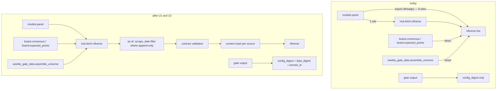
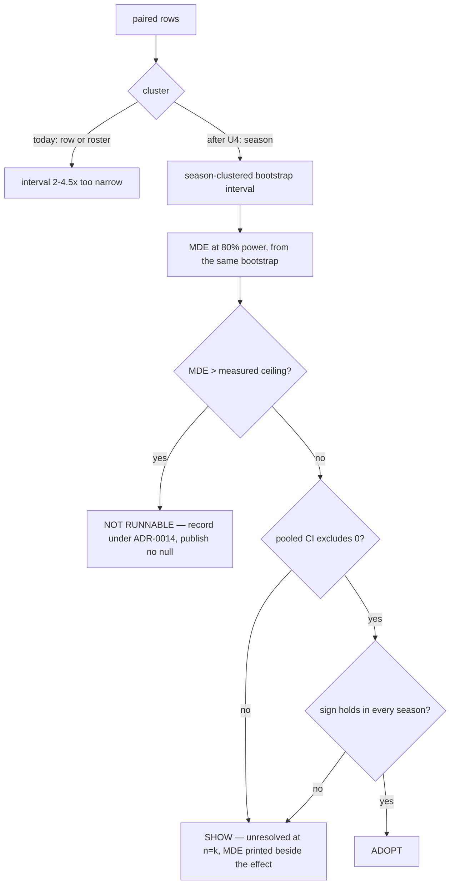
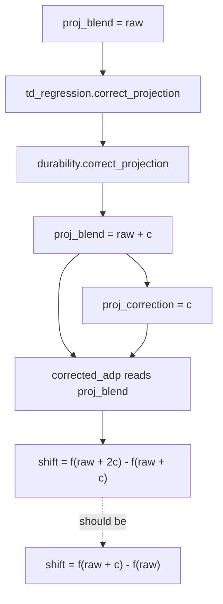

# fix: Pin the inputs, re-price the gates, correct the board

## Summary

Pin the data the repo measures against, correct the four defects that steer the board, then
re-price every published interval at the season as the replication unit. This covers the
first two phases of the 2026-09-05 independent audit — eleven of its twenty-eight findings.
The CRPS migration, reliability diagrams and the football-modelling programme are a separate
plan, because they depend on numbers this one produces.

---

## Problem Frame

The audit's claim is that the inference layer between a good architecture and good
epistemics is what fails: the unit of replication is one level too fine almost everywhere,
the adopt rule is applied at a sample size that cannot resolve the effects it is asked
about, and no gate in the tree is reproducible because the FantasyPros archive it scores
against is refetched live on every run.

Three consequences follow, and they compound in one direction. Every published interval is
narrower than the evidence supports — 2.1x at the weekly gate, roughly 4.5x at the draft
backtest and the lineup gate. The every-season conjunction then rejects a true effect
roughly 85% of the time at the observed effect size, so the twelve nulls in the record are
mostly unresolved rather than refuted. And because the archive moves under the harness, none
of it re-runs to the same number anyway — which the repo already recorded happening once, in
`docs/weekly-screen.md`.

Separately, four defects reach the board itself: corrected ADP counts each correction twice
along a steeply non-linear curve, `consensus(as_of)` has no lower date bound so stale ranks
contaminate every historical board, four shipped coefficients have no fitting code anywhere
in the tree, and pick uncertainty is modelled three different ways by three modules that
disagree by construction.

The 2026 draft ran on 2026-09-03, so none of these change a pick that has not been made.
They still change what the board says this week, and every historical board the backtest
replays.

---

## Requirements

**Reproducibility and provenance**

- R1. Every gate output carries a content-derived data digest alongside its existing config digest.
- R2. A gate re-run at the same as-of returns the same interval, not merely the same mean, on the same cache; and on a fresh clone for every source whose archive is append-only and can be filtered by as-of.
- R3. No board, current or historical, admits a consensus rank scraped outside that season's own preseason window.
- R16. `make draft` run twice from a clean checkout at a fixed as-of produces byte-identical boards.

**Board correctness**

- R9. Corrected ADP reads the market curve at the uncorrected projection, so each correction moves the pick once.
- R10. One base pick-uncertainty model serves availability, the simulated room and the lambda evaluation, fitted on a pick number over the draftable pool.
- R11. The four shipped `ppg_next` coefficients and `durability.INJURY_BETA` either have committed walk-forward fitting code with season-clustered intervals, or carry an explicit disposition flag.
- R12. The backtest publishes opponent-noise as a sensitivity across at least three scales rather than as a single unexamined default.
- R17. The corrected board is diffed against the board that drafted on 2026-09-03 and published once, after the coefficients are refit.

**Inference and the adoption rule**

- R4. Every published interval names its clustering unit, and that unit is the season wherever the season is the independent replication.
- R5. Every verdict prints the effect the run had 80% power to detect, computed from the same bootstrap that produces the interval.
- R6. A gate whose minimum detectable effect exceeds its measured ceiling records itself as not runnable and publishes no null.
- R18. Every gate publishes a measured ceiling — the gain a perfect-foresight arm achieves over that gate's own incumbent, on that gate's own harness — in the same units as its effect.
- R7. The draft backtest voids above a pre-registered join-failure floor, the way the weekly gate already does.
- R8. The screens report the number of tests in the run and a Benjamini-Hochberg threshold at q = 0.10 beside the raw t.
- R15. `docs/method.md` carries the rule that a gate's minimum detectable effect is computed before the run.

**The written record**

- R13. Every measurement this plan's own units move has one canonical published number, with superseded values in a restatement box.
- R14. The ADR index lists every ADR that exists, and every ADR resting on a verdict this plan moves is re-scored.

---

## Key Technical Decisions

- **Pin before anything else.** Any figure re-published against an unpinned archive is
  unreproducible the moment it is written, so the pin is a precondition rather than cleanup.
  This inverts the audit's own ordering, which lands the pin seventh in its second phase.

- **The as-of filters content where it can, and labels a snapshot where it cannot.**
  `nflreadpy.load_ff_rankings` takes `(type: Literal['draft','week','all'])` and nothing
  else — there is no release, tag or version argument, so an as-of cannot address a
  server-side version. What it can do is filter: the FantasyPros archive is append-only and
  carries `scrape_date`, so applying the as-of bound inside the loader reproduces the same
  rows from a later fetch. Sources that revise in place — `player_stats` and `pbp`, which
  `nflverse._write_by_key` documents as mirroring an upstream that rewrites — get a content
  hash and a `pinned_at` stamp instead, so an unreproducible re-run is *detectable* rather
  than silently assumed reproducible. R2 states both halves rather than promising one.

- **The data digest hashes content, not labels.** A hash of the source list and their as-of
  dates is invariant to exactly the drift it exists to catch: two runs labelled the same
  as-of that fetched different bytes would agree. `config_digest` hashes resolved values, not
  field names, and the data digest mirrors that substance rather than only its shape.

- **The board fixes land before the re-pricing.** Corrected ADP and unified pick noise are
  the only units with a live surface this week; the re-pricing work is retrospective. Units
  land as soon as their dependencies allow, and where two orderings are both legal the one
  with a live consequence goes first.

- **The adopt rule keeps both halves. The MDE is a precondition, not a relaxation.**
  `docs/method.md` rule 4 records an injury-type adjustment that cleared 3.1 se, won 2 of 3
  held-out seasons, and correctly failed — and states that the every-season half "is not a
  second hurdle for its own sake, it is the half that catches sign flips." Any majority
  threshold would adopt that exact result. The power problem is real but the bar is not where
  it is fixed: the audit's own proposed rule is to compute the MDE *before* the gate and
  decline to run one whose MDE exceeds its measured ceiling. So ADR-0019 is amended
  with that precondition and its two halves stand unchanged.

- **A SHOW verdict at an MDE larger than the effect reads "unresolved at n = k".** That is
  the substance of the re-pricing: not that more things get adopted, but that nulls the repo
  could never have resolved stop being recorded as refutations.

- **The board fixes are record-and-in-season fixes.** The draft ran on 2026-09-03, so
  neither U7 nor U8 changes a pick that has not been made. Note that `adp_corrected` is read
  only inside `src/hub/draft/` — `board.py`, `optimize.py`, `backtest.py` — with no consumer
  under `src/hub/season/`, so its live surface this week is the published board a human
  reads, not an automated in-season decision. `proj_blend`, which U9 moves, has the wider
  reach.

- **A coefficient that does not reproduce keeps shipping; one that reverses sign does not.**
  ADR-0007 wants a measurement that steers the product to be committed code; ADR-0014 already
  allows a provisional rule where no gate can run. Deleting a correction mid-season would
  itself be an unmeasured change to the board, so a coefficient with a wide or
  interval-containing-zero refit is flagged and kept. A refit whose point estimate has the
  *opposite* sign is a different case — `docs/method.md` rule 4 classes a sign flip as a bug,
  not a finding — and is zeroed, with the zeroing published as a measured board change.

---

## High-Level Technical Design

### The provenance chain this plan closes

The panel reaches nflverse directly for eight of nine sources, so the contract validation,
caching and pinning the README claims apply on the path that produces every published
statistic simply are not there. The same bypass exists in `weekly_gate_data.assemble_universe`
and `board.expected_points`, and in ten further modules this plan does not reach.

### The adoption rule, before and after

Both halves of the bar are unchanged. What changes is that the interval is computed at the
right unit, and that an underpowered gate declines to produce a verdict at all.

### Where the correction is counted twice

`board.build` corrects `proj_blend` in place, stores the delta, and then hands the
already-corrected frame to `corrected_adp`, which reads `board["proj_blend"]` and evaluates
`np.interp` on both sides of the correction from there.

Sign and rough magnitude survive; the magnitude is wrong by the curvature over `c`, and
systematically so, because `|df/dproj|` differs between the two evaluation points. The
existing `correction_tripwire` cannot catch it — it asserts that zero correction implies zero
move and that the move respects the clamp, and both hold under the bug.

---

## Implementation Units

Unit IDs are stable and do not renumber; the phase an ID sits in has changed since the first
draft, its identity has not. Phase 1 lands before anything is re-run, because a figure
re-published against an unpinned archive is not reproducible. Phase 2 carries the only units
with a live surface. Phase 4 is last because Phases 2 and 3 both move published figures.

### Phase 1 — Make the inputs pinnable

#### U1. A dated cache key and a content digest in the fetch layer

**Goal:** Give `hub.fetch.nflverse` an as-of dimension that filters content where the source
allows it, and emit a digest over the bytes actually loaded.

**Requirements:** R1, R2, R16

**Dependencies:** none

**Files:**
- `src/hub/fetch/nflverse.py` — `_cache_path`, `load`, per-source as-of handling
- `src/hub/config.py` — a `data_digest` helper beside `config_digest`
- `tests/unit/test_fetch_nflverse.py`
- `tests/unit/test_config.py`

**Approach:** Two mechanisms, because the sources differ. For an append-only archive carrying
a scrape date — `ff_rankings` is the one that matters — the as-of is applied as a filter
*inside the loader*, so a later fetch of a grown archive still yields the same rows. For a
source that revises in place, the as-of can only label a snapshot; record a content hash and
a `pinned_at` timestamp so a divergent re-run is detectable.

`_cache_path` keys on `(source, seasons, columns)` today. Add the as-of to the key so two
pins are two entries and neither is served the other's rows — the same reasoning the column
set is already part of the key. When no as-of is supplied, `_cache_path` returns today's
undated path exactly as now for both read and write, and `refresh=True` rewrites that same
undated key; the dated key is used only when an as-of is explicitly supplied. This is what
keeps the weekly `make slate` path, which drives `refresh=True`, working unchanged.

`data_digest` hashes the content of each pinned source — a stable hash over the frame written
to the cache path — folded with the source name and as-of. Hashing the labels alone would be
invariant to the drift the digest exists to catch.

**Patterns to follow:** `hub.fetch.odds` writes dated, immutable snapshots
(`snap-{when:%Y%m%dT%H%M%S}`) and resolves them with an as-of join — the provenance pattern
being extended. `config_digest` in `src/hub/config.py` hashes resolved values, and the data
digest mirrors that substance.

**Test scenarios:**
- A load at as-of `2026-09-04` writes a cache path containing that date; a load at `2026-08-01` writes a different path and does not read the first.
- Two loads at the same as-of invoke the underlying fetcher once.
- A load with no as-of resolves to today's undated path for both read and write, unchanged.
- `refresh=True` with an as-of rewrites that as-of's dated key; `refresh=True` with no as-of rewrites the undated key.
- For `ff_rankings`, a second fetch against an archive that has grown returns a frame identical to the first when both are filtered at the same as-of.
- Two loads at the same as-of whose underlying fetcher returns different frames produce different `data_digest` values.
- `data_digest` is stable across a fresh process for unchanged content, and changes when the as-of changes.
- A source that revises in place carries a `pinned_at` stamp in its digest record.

**Verification:** A gate output can carry a digest that changes when and only when the bytes
behind it change, and an `ff_rankings` load at a fixed as-of survives the archive growing
underneath it.

---

#### U2. Route the gate-feeding sources through the fetch layer

**Goal:** Every source that feeds a gate or screen this plan re-prices goes through
`hub.fetch.nflverse`, so contract validation, caching and the pin apply on the path that
produces published statistics.

**Requirements:** R1, R2, R16

**Dependencies:** U1

**Files:**
- `src/hub/fetch/nflverse.py` — loaders for `ff_rankings`, `injuries`, `snap_counts`
- `src/hub/contracts.py` — a contract per newly-routed source
- `src/hub/models/panel.py` — the eight direct call sites
- `src/hub/season/weekly_gate_data.py` — `assemble_universe`
- `src/hub/draft/board.py` — `consensus`, `expected_points`
- `src/hub/draft/availability.py` — `historical_picks`
- `src/hub/draft/tune.py` — `holdout`
- `tests/unit/test_panel.py`
- `tests/unit/test_weekly_gate.py`
- `tests/unit/test_fetch_nflverse.py`
- `tests/contracts/test_source_contracts.py`
- `tests/contracts/test_every_contract_is_applied.py`

**Approach:** `_fetch`'s dispatch table covers six sources; `ff_rankings`, `injuries` and
`snap_counts` are not among them and need loaders and contracts before any call site can
move. `ff_rankings` is page-typed rather than season-parameterised, so its loader takes the
page type and the as-of rather than a season list.

Scope is every source feeding a gate this plan re-prices. Beyond `panel.py` that means
`weekly_gate_data.assemble_universe`, which calls `nfl.load_player_stats(seasons=[yr])
.select(list(PLAYER_STATS_COLS))` — already narrowed to the shared column tuple, so
`nflverse.load("player_stats", [yr], cols=PLAYER_STATS_COLS)` is a drop-in — and
`board.expected_points`, which calls `nfl.load_ff_opportunity` and feeds every board U3 and
U7 correct.

Ten further modules import `nflreadpy` directly (`spread.py`, `margin.py`, `injury.py`,
`correlate.py`, `component_error.py`, `conformal.py`, `playoff_sos.py`, `publish.py`,
`store.py`, and `nflverse.py` itself, legitimately). Those are named under Deferred to
Follow-Up Work rather than silently left out — the bypass is repo-wide and this unit closes
the part that carries a published number.

Route `weekly_consensus` first and confirm the screen reproduces at a fixed as-of before
moving the rest.

**Execution note:** Add characterization coverage at a fixed as-of before moving each call
site — the assertion that matters is that the panel is frame-identical across the migration,
and that only holds if it is captured first.

**Patterns to follow:** `_raw_player_stats` and `_clean_player_stats` in
`src/hub/fetch/nflverse.py` are the loader shape; `_select_consensus` in
`src/hub/draft/board.py` is the narrowing already applied at the call site.

**Test scenarios:**
- `panel.weekly_consensus`, `weekly_gate_data.assemble_universe` and `board.expected_points` each call the fetch layer and do not import `nflreadpy`.
- Each of the three new loaders raises `ContractViolation` on a frame with a missing required column, a null in a non-nullable column, and a value outside its plausible range.
- The `ff_rankings` loader accepts a page type and an as-of and rejects a season-list argument, since the source is not season-partitioned.
- A panel built twice at the same as-of is frame-identical; built at two different as-ofs it differs, and the difference shows in `data_digest`.
- The existing golden panel fixtures pass unchanged at the pinned as-of.
- `test_every_contract_is_applied` passes with the three new contracts registered.

**Verification:** `grep -rn "import nflreadpy" src/hub/models/panel.py
src/hub/season/weekly_gate_data.py src/hub/draft/board.py src/hub/draft/availability.py
src/hub/draft/tune.py` returns nothing, and the weekly screen re-run at a fixed as-of returns
the same `r` for every feature twice.

---

#### U3. Bound consensus and historical picks on both sides

**Goal:** A board built as of a season admits only ranks scraped in that season's preseason
window, so a player ranked in 2021 and not since stops carrying his 2021 ECR onto a 2025
board.

**Requirements:** R3

**Dependencies:** U2

**Files:**
- `src/hub/draft/board.py` — `consensus`
- `src/hub/draft/availability.py` — `historical_picks`
- `tests/unit/test_consensus_page.py`
- `tests/unit/test_adp_history.py`
- `tests/unit/test_board_build.py`

**Approach:** The fix exists in the tree with its reasoning written out — `tune.holdout`
bounds `scrape_date` on both sides precisely because "a player ranked in a previous preseason
but not this one carries his stale rank forward". Copying it is not one line, because
`tune.holdout` takes a season integer while `board.consensus` takes an arbitrary ISO date
string: derive the lower bound as July 1 of the year in `as_of`, so `board_as_of`'s
`f"{season}-09-01"` yields the window `[{season}-07-01, {season}-09-01)`.

The `as_of is None` branch reads the small `draft` page and applies no `scrape_date` filter
at all. That branch is exempt from R3 and the exemption is deliberate — the `draft` page
carries only the current preseason — but it is asserted rather than assumed.

**Patterns to follow:** `src/hub/draft/tune.py:257-262`.

**Test scenarios:**
- A player whose only scrape predates the window is absent from `board_as_of` for that season.
- A player with scrapes in two seasons' windows is ranked on the current season's scrape.
- A scrape exactly at the lower bound is included; one exactly at the upper bound is excluded.
- The lower bound is derived from the year in `as_of`, asserted for a mid-season as-of as well as a September one.
- The `as_of is None` branch applies no window and the test names the exemption as deliberate.
- `ContractViolation` is still raised, with its existing message, when no scrape falls inside a season's window.
- `historical_picks` drops a pick whose only ECR comes from a prior preseason, and the matched-pick count falls accordingly.
- The board's row count at a fixed as-of falls, and the drop is reported rather than silent.

**Verification:** The 2025 board contains no player whose latest in-window scrape is from a
prior season, and the change in board height is stated in the run output.

---

### Phase 2 — Fix what steers the board

#### U7. Corrected ADP reads the curve at the uncorrected projection

**Goal:** Each correction moves the pick once, and the market curve is estimated on a board
the corrections have not already moved.

**Requirements:** R9

**Dependencies:** U3

**Files:**
- `src/hub/draft/optimize.py` — `corrected_adp`, `market_curve`
- `src/hub/draft/backtest.py` — `correction_tripwire`
- `tests/unit/test_optimize.py`
- `tests/unit/test_report.py`

**Approach:** `shift = f(proj) - f(proj - corr)`, and build `market_curve` on `(proj - corr)`.

The tripwire clause is a closed-form identity, not a monotonicity check. Monotonicity catches
nothing here: `market_curve` is forced non-increasing, and every shipped correction is
negative, so both the buggy `f(p+c) - f(p)` and the fixed `f(p) - f(p-c)` grow with `|c|`
under either implementation — and because `corrected_adp` clips at
`correction_clamp_frac = 0.20`, a "strictly larger" assertion fires spuriously against
correct code on any clamped player. Instead assert that the pre-clamp shift equals
`np.interp(proj, xs, ys) - np.interp(proj - corr, xs, ys)` with `xs, ys =
market_curve(adp, proj - corr)`, recomputed independently from the board's `proj_blend` and
`proj_correction` columns. That expression is false under the current implementation, true
under the fix, and unaffected by the clamp because it is evaluated before clipping.

The board diff this produces is recorded in the working record; publication is U12's, after
U9 refits the coefficients that feed `proj_correction`.

**Patterns to follow:** ADR-0011 is the decision this implements correctly for the first time.

**Test scenarios:**
- A player with zero correction does not move — the existing tripwire clause, unchanged.
- A player with a positive correction moves earlier and one with a negative correction moves later.
- The pre-clamp shift equals the closed-form identity on a synthetic curve with known curvature, and differs from the current implementation's result by the curvature term.
- The identity clause fails against the pre-fix implementation and passes against the fixed one.
- The identity clause holds for a clamped player, because it is evaluated pre-clamp.
- The clamp still bounds the applied shift at the configured fraction of the player's own ADP.
- `market_curve` fitted on `(proj - corr)` differs from one fitted on `proj` when any correction is non-zero, and is identical when all are zero.
- A player near a rolling-median window boundary, where re-sorting on `(proj - corr)` changes window membership, is covered explicitly.
- A board with no `proj_correction` column returns raw ADP, unchanged.

**Verification:** The tripwire fails against the pre-fix implementation and passes against the
fixed one, and the board diff is recorded for U12.

---

#### U8. One base pick-uncertainty model

**Goal:** Availability, the simulated room and the lambda evaluation read one base pick
dispersion, fitted on a pick number over the draftable pool.

**Requirements:** R10

**Dependencies:** U3

**Files:**
- `src/hub/draft/availability.py` — `_sigma`, `pick_noise`, `fit_pick_noise`, `blended_adp`
- `src/hub/draft/optimize.py` — the room's noise draw
- `src/hub/draft/evaluate.py` — `OPP_NOISE`
- `src/hub/draft/board.py` — `_attach_edge`, for `consensus_pick`
- `tests/unit/test_availability.py`
- `tests/unit/test_fit_noise.py`
- `tests/unit/test_optimize.py`
- `tests/unit/test_draft_eval.py`

**Approach:** Three problems, one base model — and one scale knob that stays a knob.

`_sigma` prefers `ecr_sd`, FantasyPros' cross-expert dispersion of the consensus rank, over
`pick_noise`, the fitted dispersion of where a player actually goes. Those are different
quantities and the first is typically far smaller, so availability is systematically
overconfident about who survives. If `ecr_sd` is kept it becomes an additive component, not a
substitute.

`mu_pick = w*adp + (1-w)*ecr` blends a pick number over the ~460-player draftable pool with a
rank over the ~1,100-row consensus board, so `pick_noise(mu_pick)` is evaluated at an inflated
argument. Fit and evaluate on `consensus_pick` instead — `_attach_edge` already computes it
and its docstring already states why both operands must be pick numbers over the same
population.

`fit_pick_noise`'s pinned branch computes `b = dot(mu, maximum(sigma_hat - a, 0)) /
dot(mu, mu)`, which truncates the response before a through-origin fit rather than
constraining it, inflating the slope by the clipped mass. Replace with a proper
non-negative-intercept least squares, and report a draft-clustered interval: the 734 picks
come from four drafts, so the clustering unit is the draft and n is 4.

Unification is of the *base* model only. `pick_noise(consensus_pick)` is the single source of
dispersion; the room's sigma is `opp_noise * pick_noise(consensus_pick)`, with `opp_noise`
remaining U10's sensitivity knob — the comment at `optimize.py:119-126` is explicit that the
ECR-fitted spread is not the right quantity for opponents and must be scaled. This unit also
converts `evaluate.OPP_NOISE = 8.0` from an absolute standard deviation added to ECR into an
`opp_noise` scale over the base model, which changes what the lambda evaluation measures and
is why U12 re-runs the sweep.

**Patterns to follow:** `_attach_edge` in `src/hub/draft/board.py:281-303` is the
population-matching fix, already written and explained. `hub.schedule`'s unification of the
spread is the precedent for one quantity with one home.

**Test scenarios:**
- `_sigma` returns the same value for a player with and without `ecr_sd` when `ecr_sd` is zero, and a wider value when it is positive — additive, not substitutive.
- `pick_noise` on `consensus_pick` returns a smaller sigma than on raw `ecr` for a player deep on the board, and the gap widens down the board.
- The constrained fit recovers a known `(a, b)` from synthetic data whose true intercept is positive.
- The constrained fit does not exceed the truncated fit's slope on data whose unconstrained intercept goes negative.
- The fit falls back to the stated prior, loudly, below the 50-pick floor.
- The draft-clustered interval on the fitted slope is reported and is wider than a pick-level interval on the same data.
- `availability`, `simulate_remaining_draft` and `evaluate` resolve to the same *base* sigma for the same player on the same board at `opp_noise = 1.0`.
- At `opp_noise = 1.5` the room's sigma is 1.5x the base and availability's is unchanged.
- `evaluate` with the converted scale reproduces its prior behaviour at the `opp_noise` value equivalent to the old flat 8.0.

**Verification:** One function is the only source of base pick dispersion in `src/hub/draft/`,
and a player's `cost_of_waiting` computed through availability matches the frequency with
which the simulated room lets him fall at `opp_noise = 1.0`.

---

### Phase 3 — Re-price what is already measured

#### U13. The ceiling arm each gate is measured against

**Goal:** Every gate carries a measured ceiling — the gain a perfect-foresight arm achieves
over that gate's own incumbent, on that gate's own harness — so the not-runnable branch
compares the MDE against a number rather than a judgment.

**Requirements:** R6, R18

**Dependencies:** U2, U3

**Files:**
- `src/hub/season/weekly_gate.py` — a foresight arm
- `src/hub/season/lineup_gate.py` — a variance-oracle arm
- `src/hub/draft/backtest.py` — `foresight_strategy`
- `src/hub/models/experiment.py` — the ceiling carried beside the effect
- `docs/method.md` — rule 13's ceiling clause
- `tests/unit/test_weekly_gate.py`
- `tests/unit/test_lineup_gate.py`
- `tests/unit/test_backtest.py`
- `tests/unit/test_experiment.py`

**Approach:** The ceiling is measured, not judged. `docs/player-spread.md` closed its question
by computing the irreducible sampling noise in the outcome — 1.0113 MAE against the shipped
model's 1.0965, leaving 0.085 of headroom for every future model combined — rather than by any
candidate's failure, and `docs/method.md` rule 8 codifies that as the method. The same
instrument applies to a gate: the largest effect a mechanism could produce is what perfect
knowledge of that mechanism's target delivers against the same incumbent.

Each harness already loads the realised matrix the arm needs, so this is a third score column
rather than new data.

- **Weekly gate** — score on realised weekly points in place of the weekly projection. This
  bounds any weekly projection against consensus, in points per team-week. `coverage` already
  reads `g.realised`, so the matrix is in hand.
- **Lineup gate** — a *variance* oracle, not a full-foresight one. Both arms of that gate see
  the same `mu`, and the optimiser's only advantage is that it also reads `sd`; a
  full-foresight arm would measure the value of knowing the outcome, which is a different
  quantity and the trap `docs/method.md` rule 9 records. Hold `mu` at the projection and supply
  the realised per-player weekly standard deviation.
- **Draft backtest** — a `foresight_strategy` ranking on realised season points, alongside
  `market_strategy` and `optimizer_strategy`. This bounds any board, in points per team game.
  Both arms already score with hindsight-optimal lineups, so the oracle here is about which
  players, not which lineup.

Units are per gate and never compared across gates — points per team-week and points per team
game are different quantities, which is rule 9 again.

**Execution note:** Land the backtest arm first. It is one more `strategy` function against an
existing protocol, so it proves the instrument at the lowest cost before the two season gates
need score-matrix changes.

**Patterns to follow:** `backtest.market_strategy` is the strategy shape to copy.
`docs/player-spread.md` is the write-up shape — the ceiling stated first, the candidate second.

**Test scenarios:**
- The foresight arm never loses to its incumbent in any held-out season, in any of the three harnesses.
- The foresight arm's gain is greater than or equal to the arm under test's gain on the same paired frame.
- The lineup gate's variance oracle holds `mu` identical to both arms and differs only in `sd`.
- A full-foresight arm on the lineup gate returns a strictly larger gain than the variance oracle, asserting the two are different quantities rather than interchangeable.
- Each gate reports its ceiling, its measured effect and its MDE in the same units.
- The ceiling is recomputed when the season set changes and is not served from a cache keyed on a different season set.
- A gate whose MDE exceeds its ceiling reports the ratio rather than only a boolean.

**Verification:** Each of the three gates prints its ceiling beside its effect and its MDE,
with the MDE-to-ceiling ratio stated, and `docs/method.md` rule 13 names the ceiling as the
quantity the not-runnable branch reads.

---

#### U4. Season clustering, the MDE line, and the not-runnable branch

**Goal:** Every gate resamples the season, prints the effect it had 80% power to detect, and
declines to publish a null it never had the power to establish.

**Requirements:** R4, R5, R6, R15

**Dependencies:** U2, U3, U13

**Files:**
- `src/hub/models/experiment.py` — `summarise`, `paired_report`, `gate`
- `src/hub/season/weekly_gate.py` — `CLUSTER`
- `src/hub/season/weekly_gate_data.py` — the mixed-scale score column
- `src/hub/season/lineup_gate.py` — `main`
- `src/hub/draft/backtest.py` — `main`
- `docs/adr/0019-a-gate-requires-every-season.md`
- `docs/method.md` — rule 13
- `tests/unit/test_experiment.py`
- `tests/unit/test_weekly_gate.py`
- `tests/unit/test_lineup_gate.py`
- `tests/unit/test_backtest.py`

**Approach:** Three call sites pass a coarser cluster: `backtest.main` and `lineup_gate.main`
pass none, and `weekly_gate` clusters at `("season", "roster")` when forty rosters per season
share a board, a seat and one realised outcome matrix. All three become `cluster=("season",)`.
`summarise`'s docstring, which names `backtest.compare` as "independent rooms: no cluster", is
the load-bearing text to rewrite.

The MDE comes from the same bootstrap that produces the interval — the effect size at which
80% of bootstrap replicates exclude zero — not from a `(t_crit + z_0.8) * sd / sqrt(k)` t
approximation. At k = 4 a percentile bootstrap and a paired t-test are not interchangeable,
and a printed power statement describing a test the gate does not run would misfire the
not-runnable branch in both directions. `summarise` computes it from its own cluster-mean
vector and returns it as `s["mde"]`; `paired_report` reads `s["mde"]` and prints it
unconditionally, so no call site's signature changes. `models/spread.py` and
`models/weekly_screen.py` define their own local `summarise` and are unaffected.

Both halves of the adopt rule are unchanged — pooled CI excludes zero *and* the sign holds in
every season. ADR-0019 is amended with the MDE precondition rather than replaced, and
`docs/method.md` rule 4's worked example still fails under the amended rule, which is the
check that the amendment is safe.

One deferred defect is pulled in as a precondition: the weekly gate's treatment arm scores on
a column mixing negated ECR with fantasy points, so `starting_lineup` ranks any player
carrying a projection above every player carrying only a rank. Re-pricing that gate without
fixing it would publish a restatement box around a number still requiring restatement.

**Execution note:** Write the MDE test against the audit's worked numbers before implementing
it — the four blend gains are a known-answer case.

**Test scenarios:**
- `summarise` with `cluster=("season",)` on a frame whose within-season rows are near-identical returns a materially wider interval than the unclustered call.
- `summarise` with `cluster=("season",)` returns the same mean as the unclustered call when seasons are balanced.
- The bootstrap MDE on the four published blend gains lands in the neighbourhood the audit's t-based figure predicts, and the test records both so the divergence at k=4 is visible.
- `summarise` returns a stated sentinel for `mde`, not a crash or a silent zero, with fewer than two clusters.
- `paired_report` includes the MDE line for every caller, including `weekly_gate.main`, which passes `show_n=False`.
- When the season-clustered interval is *narrower* than the pre-change interval on the same data, the run prints the ratio and records itself as requiring review rather than adopting.
- `gate` still ADOPTs only when the pooled CI excludes zero and the sign holds in every season.
- `gate` does not ADOPT at 2 of 3 seasons with a pooled CI excluding zero — `method.md` rule 4's worked example.
- `gate` returns NOT RUNNABLE when the MDE exceeds the ceiling U13 supplies, ahead of every branch except VOID.
- The weekly gate's treatment arm scores on one scale, and a rostered player carrying only a rank is not ranked above every projected player.
- Each of the three harnesses passes `cluster=("season",)` — asserted on the call argument.

**Verification:** Re-running the market/Usage blend gate produces a season-clustered interval
materially wider than the previously published one, an MDE line beside the measured effect,
and a verdict that reads as unresolved rather than as a null.

---

#### U5. A join-failure void on the draft backtest

**Goal:** The draft backtest refuses to report when too many roster names fail to join,
instead of scoring the failures as zero.

**Requirements:** R7

**Dependencies:** U3, U4

**Files:**
- `src/hub/draft/backtest.py` — `score_roster`, `compare`, `verdict`, `main`
- `tests/unit/test_backtest.py`

**Approach:** `score_roster` zero-fills a grid and fills from a `player_key` match, so a
player whose FantasyPros name does not normalise to his nflverse name scores zero for the
season — indistinguishable from hurt, cut or never played. The two arms draft different
players, so a differential failure rate is a differential bias in the headline number.

The discriminator cannot be copied from the weekly gate. `weekly_gate.coverage` separates
"unranked" from "join failure" because the consensus matrix and the realised matrix are
indexed by the same `(roster, week)` slot, so points exist independently of the ranking join;
on the draft side the only key *is* the name, so a name that fails to normalise has no row at
all. The discriminator here is a name crosswalk: build the set of `player_key`-normalised
names in that season's realised frame, and count a drafted name as a join failure when it is
absent from that set but matches a realised name under a relaxed comparison — surname, first
initial, and position. `experiment.gate`'s existing `void` argument carries the result.

Depends on U4 because U4 touches `gate`; the two must agree on its interface.

**Patterns to follow:** `weekly_gate.VOID_FLOOR` and its pre-registered floor are the shape;
`coverage`'s unranked-versus-failure distinction is the idea, not the mechanism.

**Test scenarios:**
- A roster where every name matches reports a join-failure rate of 0.0.
- A drafted name absent from the realised frame but matching under the relaxed comparison is counted as a join failure.
- A drafted name with no relaxed match in the season's realised names is counted as never-played, not as a join failure.
- `verdict` returns VOID above the floor, naming the pre-registered floor in its message.
- Below the floor the verdict is byte-identical to today's for the same inputs.
- Both arms' rates appear in the output, and a run where they differ says so.

**Verification:** A backtest run on a deliberately corrupted name map returns VOID rather than
a number; a clean run reports rates for both arms beneath the floor.

---

#### U6. A Benjamini-Hochberg threshold and a test tally in the screens

**Goal:** The screens report how many tests they ran and what threshold controls the false
discovery rate at q = 0.10, beside the raw t they already print.

**Requirements:** R8

**Dependencies:** none

**Files:**
- `src/hub/models/weekly_screen.py` — `screen`, `screen_joint`, `screen_usage`, `report`
- `docs/method.md` — the running tally
- `tests/unit/test_weekly_screen.py`

**Approach:** BH at q = 0.10 reported alongside the raw t, not replacing the pre-registered
rule. Bonferroni is the wrong instrument — the cost of a false positive here is "we tried a
feature", not "we approved a drug". The tally is a one-page table in `method.md`: family,
cells per family, pre-registered versus exploratory. The three real exposures to name are the
twenty-cell Usage pass, the ten-pair opponent-correlation sweep, and the five sequential
weekly rescue variants against the same held-out seasons. Surviving hypotheses are candidates
for pre-registered confirmation on future seasons, not findings.

**Patterns to follow:** `report` already returns lines rather than printing; the BH column
joins that block. `docs/improvements.md:212` and `docs/td-luck.md:49` are the two informal
within-family asides to supersede.

**Test scenarios:**
- BH on a known p-value vector returns the textbook threshold and rejection set.
- BH with every p-value at 1.0 rejects nothing and does not raise.
- BH with a single test returns that test's own p-value as the threshold.
- `screen` reports a test count equal to the number of features it evaluated.
- `screen_usage` reports its own count over its own family, not the union with `screen`.
- A feature that clears the pre-registered rule but falls below the BH threshold is reported as clearing, with the BH result beside it — the pre-registered rule is not silently overridden.

**Verification:** A screen run prints the family size and the BH threshold for every feature,
and `method.md` carries a tally whose totals match what the screens report.

---

#### U9. The correction coefficients as committed, walk-forward code

**Goal:** The coefficients that steer the board have fitting code in the tree, fitted against
the quantity they actually correct, with season-clustered intervals and an explicit
disposition.

**Requirements:** R11

**Dependencies:** U2, U3, U4

**Files:**
- `src/hub/draft/fit_corrections.py` — new
- `src/hub/config.py` — a `NOT_FITTED` entry for the new module
- `src/hub/draft/regression.py` — `TD_LUCK_BETA` and its provenance block
- `src/hub/draft/durability.py` — `BETA`, `INJURY_BETA`
- `tests/unit/test_fit_corrections.py` — new
- `tests/unit/test_config.py`
- `tests/unit/test_regression.py`
- `tests/unit/test_durability.py`
- `docs/td-luck.md`, `docs/durability.md`

**Approach:** `grep -rn ppg_next` returns four hits: two comments and two test docstrings.
There is no fitting code, no data snapshot and no bootstrap behind `TD_LUCK_BETA` (QB -0.540,
WR -0.286) or `durability.BETA` (QB -0.457, WR -0.151), which violates ADR-0007. The existing
tests assert multiplication, not the coefficient.

Two things change beyond committing the fit. The comments say the regression is against
`proj_ppg`, but `board.py:583` sets `proj_blend = coalesce((proj_ppg + xfp_per_game)/2, ...)`
and the corrections are applied to `proj_blend` — the residual left in a blend of ESPN's
projection and last season's xFP rate is not the residual left in ESPN's projection. Fit
against `proj_blend`. And the intervals are season-clustered, which will widen all four: WR
touchdown luck was already applied by judgment at 89.3%.

`durability.INJURY_BETA` is in scope and is a different specification — its provenance block
records `total_next/17 ~ proj_ppg + designation` over 1,263 player-seasons, and the audit's
"n = 27" is the count of treated OUT/DOUBTFUL/IR cells within that sample, not the regression
n. Reconcile the two figures in the provenance block rather than replacing one with the other.

Three dispositions, not two. A coefficient that reproduces within tolerance is REPRODUCED. One
whose refit is wide or contains zero is UNREPRODUCED: it keeps applying, flagged and surfaced
in the board output, because deleting a correction mid-season is itself an unmeasured change.
One whose refit has the *opposite sign* is SIGN_REVERSED: it is set to zero, because
`method.md` rule 4 classes a sign flip as a bug rather than a finding, and the flag-don't-delete
argument is about magnitude uncertainty, not disconfirmation. A SIGN_REVERSED zeroing is
published as a measured board change with its own before/after diff.

A new module under `src/hub/` must be registered in `config.NOT_FITTED` or
`tests/unit/test_config.py`'s tree walk fails on the first commit.

**Execution note:** Fit and record before touching the shipped constants, so the diff per
coefficient is a single reviewable number.

**Patterns to follow:** `experiment.expanding_seasons` is the walk-forward split — it states
`method.md` rule 2 in code and `backtest` never calls it. ADR-0006 governs where a fitted
constant lives with its provenance; ADR-0014 governs acting provisionally where no gate can
run.

**Test scenarios:**
- The walk-forward fit never scores a season on data from that season or later — asserted on the split, not the output.
- The fit recovers a known coefficient from synthetic data with a planted effect.
- A season-clustered interval on synthetic data is wider than a player-clustered one for the same planted effect.
- Each coefficient resolves to exactly one of REPRODUCED, UNREPRODUCED, SIGN_REVERSED.
- An UNREPRODUCED coefficient still applies to `proj_blend`, so the board does not silently change while the flag is up.
- A SIGN_REVERSED coefficient is set to zero and does not apply the shipped value.
- The board output names any unreproduced or sign-reversed correction and its disposition.
- `INJURY_BETA` carries an interval or a disposition flag alongside the four `ppg_next` coefficients.
- `test_config`'s registry walk passes with the new module registered.
- The existing tautological assertions in `test_regression.py` and `test_durability.py` are replaced by assertions on the fit.

**Verification:** `grep -rn ppg_next src/` returns fitting code, and every coefficient in
`regression.py` and `durability.py` carries either a season-clustered interval or a visible
disposition flag.

---

#### U10. Opponent-noise as a published sensitivity

**Goal:** The backtest reports how much of the greedy's edge is the opponent-noise scale,
across at least three values.

**Requirements:** R12

**Dependencies:** U4, U5, U7, U8

**Files:**
- `src/hub/draft/backtest.py` — `main`, a sensitivity flag
- `src/hub/draft/optimize.py` — the `opp_noise` default and its comment
- `tests/unit/test_backtest.py`
- `docs/` — the sensitivity table

**Approach:** The comment at `optimize.py:119-126` says using the ECR-fitted spread for
opponents "credits opponents with far more error than the premise allows, and every point of
that error becomes edge for the greedy. Scale it explicitly and treat the result as a
sensitivity, not a measurement." `opp_noise` defaults to 1.0 and no caller in `src/` or
`tests/` passes anything else, so the shipped and backtested configuration is the one the
comment identifies as inflating the edge. Run at {0.5, 1.0, 1.5} and publish the table.

The sensitivity runs over the base model U8 establishes, on boards U3 and U7 have corrected,
under U4's season-clustered intervals. The -19.66 result is not expected to survive unchanged
— losing four of four seasons at twenty points is not a clustering artefact, but the magnitude
sits on top of four fixes that all land first.

**Test scenarios:**
- The sensitivity runner invokes the backtest once per scale and returns one row each.
- Two scales produce different paired means on the same seed — the knob is connected.
- The same scale on the same seed reproduces exactly.
- Each row names its scale beside its interval, so no row can be read without it.

**Verification:** A three-row table giving the paired mean, season-clustered interval and MDE
at each scale.

---

### Phase 4 — Reconcile the record

#### U12. Publish the corrected board, once

**Goal:** One published diff between the board that drafted on 2026-09-03 and the board after
every correction in this plan.

**Requirements:** R17

**Dependencies:** U7, U8, U9

**Files:**
- `docs/` — the counterfactual board write-up
- `docs/lambda-sweep.md`
- `tests/unit/test_board_build.py`

**Approach:** U7 changes the curve read, U8 changes pick dispersion, and U9 changes
`proj_correction` — which changes `adp_corrected`, which changes the board order any
counterfactual is computed from. Publishing after U7 or U8 alone would put out a figure U9
then moves, which is the restate-twice failure R13 exists to prevent. So the diff is computed
and published once, here.

The same argument applies to the lambda sweep: `docs/lambda-sweep.md` names `hub.draft.evaluate`
as the decisive metric for `projection_lambda = 0.0`, and U8 replaces that harness's opponent
model. Re-run `hub.draft.evaluate --sweep` under the unified base model and record whether
`lam = 0.00` still wins.

**Test scenarios:**
- A board rebuilt at the 2026-09-03 as-of on pre-fix code reproduces the board that drafted, so the diff has a valid baseline.
- The diff names every player whose corrected-ADP rank moves, and the movement at each of the user's actual turns.

**Verification:** One published counterfactual, computed after U9, with the lambda sweep
re-run beside it.

---

#### U11. One canonical number per measurement

**Goal:** Every measurement this plan moves has one published figure, superseded values sit in
restatement boxes, and every ADR resting on a moved verdict is re-scored.

**Requirements:** R13, R14

**Dependencies:** U4, U9, U10, U12

**Files:**
- `CONTEXT.md`
- `docs/architecture.md` — the ADR index
- `docs/method.md` — the track-record table
- `docs/track-record.md`
- `docs/weekly-projection.md`, `docs/next.md`, `docs/weekly-projection-plan.md`
- `docs/signal-screens.md`, `docs/what-the-field-knows.md`, `docs/parameter-uncertainty.md`
- `docs/expected-and-routes.md`, `docs/decisions.md`, `docs/weekly-blend-gate.md`
- `docs/td-luck.md`, `docs/durability.md`, `docs/lambda-sweep.md`, `docs/gaps.md`
- `docs/adr/0009-championship-equity-does-not-pick.md`
- `docs/adr/0013-the-snap-trend-is-shown-and-never-ranked-on.md`
- `docs/adr/0016-the-weekly-projection-is-shown-and-never-ranked-on.md`
- `docs/adr/0017-the-market-usage-blend-is-a-model-not-a-shrinkage.md`
- `docs/adr/0019-a-gate-requires-every-season.md`

**Approach:** The repo's pitch is that the most useful artifact is the record of what was
measured and then removed, which makes a stale record the highest-severity documentation
defect available. Scope is the drift this plan's own units cause or supersede: Gate B's
headline standing four ways across three files, the blend headline standing at the superseded
+0.711 in five documents, the ADR index stopping at 0014 while 0022 exists, and every figure
U4, U9, U10 and U12 move. `CONTEXT.md` is in scope because CLAUDE.md designates it the
single-context domain doc, so a superseded figure there is ingested as authoritative by every
future session.

Re-score the ADRs whose verdicts move. A gate reclassified NOT RUNNABLE under U4 is an absence
of evidence rather than a gate that fired, which is the eligibility line `method.md` rule 12
draws — so ADR-0014 is amended to state explicitly that a reclassification does not by itself
make a previously-failed decision eligible for provisional adoption. Without that, ADRs 0009,
0013 and 0016 silently move from excluded to eligible.

ADR-0017's re-scoring is a procedure, not a pre-computed conclusion: re-score its three
pre-stated clauses — "positive but small, interval containing zero, SHOW" — against whatever
season-clustered interval U4 produces. Writing the answer here against the pre-U4 figure would
be the plan pre-writing a verdict before the measurement exists.

**Test expectation:** none — documentation reconciliation, with no behavioural surface.

**Patterns to follow:** `docs/weekly-blend-gate.md`'s restatement boxes are the convention —
superseded figures stay visible with the reason they moved.

**Verification:** A grep for each superseded figure this plan moved returns either nothing or
a hit inside a restatement box; `docs/architecture.md` lists 0001 through 0022; every figure
in `CONTEXT.md` matches its canonical value or sits in a restatement box; and each of ADR-0009,
0013, 0016 and 0017 carries a dated re-scoring.

---

## Scope Boundaries

**In scope:** the eleven audit findings its first two phases cover, plus two preconditions the
review surfaced — the weekly gate's mixed-scale score column, which contaminates a gate U4
re-prices, and `INJURY_BETA`, which shares U9's provenance problem.

### Deferred to Follow-Up Work

Most of these depend on numbers this plan produces. Two do not and are deferred on capacity
grounds, which is stated rather than blurred.

Dependent on this plan's outputs:

- CRPS as the primary loss, and re-running the weekly projection question under it.
- CORP reliability diagrams on every shipped probability, starting with survivor win probability by spread bucket.
- The discrete margin mass function with real weight at 3 and 7, and the rolling eight-week survivor horizon.
- Byes and in-season absence as a Bernoulli per player-week, and the `TALENT_CV` refit that follows.
- A shrunk, streaming-aware replacement level on one basis.
- Rookie and returning-veteran dispersion.
- Touchdown-rate disattenuation, and a goal-line-share term in the RB baseline.
- Simulator constants fitted on the backtest's own held-out seasons.
- The paired standard error in `rank_tiers`, the week-number dedupe in `eval._holdout_weeks`, the screen's cell-versus-season unit, and the `td_rate_prior` control basis.

Independent, deferred on capacity:

- `priced_games(league='cfb')` returning NFL games, and CFBD caching's missing refresh path.
- The ten remaining modules that import `nflreadpy` directly — `spread.py`, `margin.py`, `injury.py`, `correlate.py`, `component_error.py`, `conformal.py`, `playoff_sos.py`, `publish.py`, `store.py`. None currently carries a number this plan re-publishes; the bypass is repo-wide and U2 closes only the part that does.
- Pre-existing documentation drift this plan's units do not touch: `P(title | seed 1)` appearing as four figures, and the receiving TD-rate persistence sign inconsistency inside `decisions.md`.

### Outside this plan's identity

- Building a team-ratings model. The audit is explicit that this is not the gap.
- Changing `MARGIN_SD`. The scale is independently corroborated at 12.78 by Glickman & Stern; only the shape is wrong, and the shape is deferred above.
- Replacing the market passthrough.
- Lowering the adopt bar. The power problem is fixed by declining to run an underpowered gate, not by making it easier to pass.

---

## Risks and Dependencies

- **Cross-clone reproducibility is only guaranteed for the append-only sources.** `data/raw/`,
  `data/interim/` and `data/processed/` are all gitignored with zero tracked files, and
  `data/processed/` is excluded explicitly because it holds third-party data the repo cannot
  redistribute. So the pin has no committed artifact behind it. For `ff_rankings` the as-of
  filter makes a re-fetch reproduce the same rows anyway; for sources that revise in place it
  does not, and R2 says so rather than promising otherwise.

- **Re-published figures will not reproduce the old ones.** The archive has moved since each
  was measured. The mitigation is the restatement-box convention applied as numbers move, not
  a cleanup pass at the end.

- **Season clustering will make most intervals uninformative, and that is the finding.** At
  four seasons the MDE for the cleanest gate in the repo is roughly five times the effect
  being argued about. A reader skimming the diff will read that as a regression; the MDE line
  is what stops them.

- **A narrower interval after clustering would be a signal, not a win.** Widening depends on
  between-season variance exceeding within-season variance. Where the season means sit close
  together a four-unit bootstrap can return a narrower interval than the current one — which
  means the clustering unit or the estimator is wrong, and U4 records it for review rather
  than adopting through it.

- **The bootstrap estimator itself is unchanged.** At k = 4 every re-priced interval inherits
  the small-sample coverage of a four-element percentile bootstrap, and ADR-0019 is amended on
  top of it. If that estimator is the wrong instrument at this n, the error carries forward
  into the deferred CRPS and reliability work.

- **U3 and U8 both move the fitted pick-noise slope.** U3 drops the deep-board, intermittently
  ranked players who are the high-`mu` leverage points of `sigma = a + b*mu`, and U8 removes
  the truncation branch. Fit once after U3 and before U8's estimator change, so the published
  slope movement is attributable.

- **The backtest re-runs are expensive.** Four seasons x 20 drafts x 12 x 250 sims, three
  times for U10's sensitivity, and `compare`'s docstring warns that lowering the sim counts
  measures a different optimizer. No wall-clock estimate exists; measure one before committing
  to the sensitivity table.

- **The in-season path must keep running throughout.** `make slate` runs weekly from Week 1
  and the degradation rule requires last-good state from `data/processed/` rather than an
  error. U1's as-of is optional precisely so the live path is untouched, and every unit should
  be checked against a slate run before it lands. CLAUDE.md reserves Thursday onward for
  lineup day; Phases 3 and 4 should be scheduled Monday to Wednesday.

- **The working tree carries roughly 1,245 uncommitted lines** across `publish.py`,
  `survivor.py`, `site/index.html` and three test files. U11 touches documentation that
  overlaps that work. Land or stash it before Phase 4.

---

## Open Questions

- At what fraction of its ceiling does a gate stop being worth running? U13 makes the
  comparison mechanical at a ratio of 1.0 — an MDE larger than the ceiling cannot resolve
  anything. But a gate whose MDE is 0.7 of its ceiling can only ever detect an effect nobody
  believes is achievable, and it would still run. That threshold is a judgment; the ceiling it
  is a fraction of is not.

- Which of the twelve nulls, if any, is expected to become a live candidate after re-pricing?
  Naming zero is an acceptable answer and would sharpen what Phase 3 buys. `docs/method.md`
  attributes the twelve to a structural cause — "they all tried to out-think a market using
  information that market had had all summer" — which widening intervals does not touch.

- What is the stopping point? If Phase 2 completes in Week 3 and Phase 3 is still open in
  Week 8, is the remainder carried, paused to the offseason, or abandoned? Each phase's
  verification is a bankable checkpoint, but the plan does not say which are optional.

- Does the track-record table in `docs/method.md` keep its rows with re-labelled verdicts, or
  gain an MDE column? It is the repo's most-quoted artifact and U11 does not say what shape it
  ends in.

- Should the drafted roster's expected value be restated alongside U12's counterfactual, or is
  publishing the board diff alone the right scope? The counterfactual is clearly worth
  publishing; restating the season's expectation from it is a product call.

---

## Sources and Research

- `football-hub-audit.json`, 28 findings over 15,497 lines of source and 22 ADRs. Its
  `power_analysis` block carries the reproduction snippet for the t-based MDE figures; U4
  computes the MDE from the bootstrap instead, and records both so the divergence is visible.
- Verified directly against the working tree: the three unclustered `summarise` call sites;
  `corrected_adp`'s curve read; the one-sided `scrape_date` filters in `board.consensus` and
  `availability.historical_picks`; the eight direct `nflreadpy` call sites in `panel.py` plus
  the bypasses in `weekly_gate_data.assemble_universe` and `board.expected_points`;
  `fit_pick_noise`'s truncation branch; the absence of any `ppg_next` fitting code;
  `opp_noise`'s single default with no non-default caller; `market_curve`'s rolling median and
  `np.maximum.accumulate`; `nflreadpy.load_ff_rankings`'s signature carrying no version
  argument; `adp_corrected`'s three consumers, all under `src/hub/draft/`; the gitignore
  excluding all of `data/` with zero tracked files; `config.NOT_FITTED` and the `test_config`
  tree walk; and the ADR index stopping at 0014.
- Carried from the audit as reported rather than verified: the multiplicity counts (~64
  comparisons, ~185 headline statistics, ~2,000 partial correlations), the 2.1x and 4.5x
  interval-widening factors, the 85% rejection rate at the observed effect size, and the line
  numbers in U11's drift inventory. Confirm each before acting on it.
- `docs/method.md` rule 4 — the injury-type adjustment that cleared 3.1 se, won 2 of 3
  seasons and correctly failed. The reason the adopt bar keeps both halves.
- `docs/method.md` rule 12 — "a gate that fired against you is evidence; a gate that cannot
  run is an absence of evidence". The eligibility line ADR-0014's amendment turns on.
- `src/hub/draft/tune.py:257-262` — the two-sided `scrape_date` bound U3 copies.
- `src/hub/models/experiment.py` — `expanding_seasons`, `summarise`'s cluster mechanism and
  `gate`'s ADR-0019 branches are the three seams U4 works on.
- `src/hub/season/weekly_gate.py` — `VOID_FLOOR` and its pre-registered floor, the shape U5 copies.
- `src/hub/fetch/odds.py` — the dated immutable snapshot pattern U1 extends.
- `docs/weekly-blend-gate.md` — the restatement-box convention U11 applies.
- No external research was run. The audit carries 25 external references, local patterns are
  strong for every seam this plan touches, and nothing here turns on an unsettled external
  option set.
