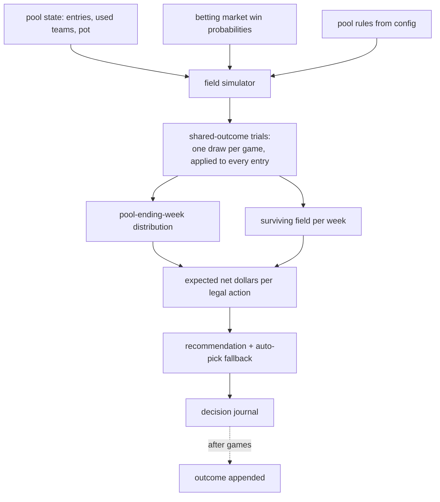
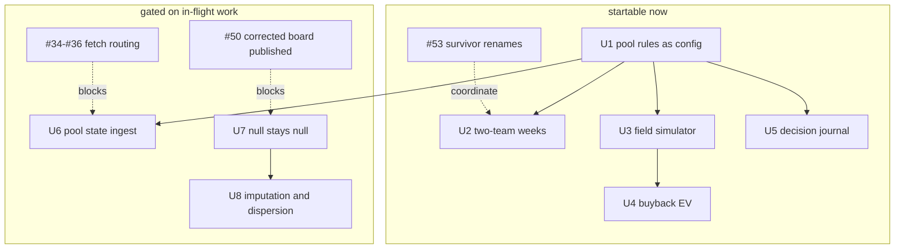

# feat: Survivor money layer and board realism

## Summary

Extend the survivor solver to the pool that exists — two-team weeks, a season-long used-team
ledger, and an expected-dollar objective over the survival objective it already solves — and
repair the board so a player with no usable prior season stops receiving his own consensus
rank back with a durability bonus attached. A decision journal sits under both.

> **Renamed 2026-09-05.** U5's record was "the decision ledger" throughout this plan. **Ledger**
> is the set of teams an entry has spent — the sense R2, R17 and U3 use, and the one shipped code
> already carries (`hub.season.pool` takes `ledger`/`ledgers`, `buyback_restores_ledger` is a pool-config
> field). One word for both was the collision; U5's is the **Decision journal** now, and `CONTEXT.md`
> defines both. The used-team uses below are correct and unchanged.

---

## Problem Frame

Two failures, unrelated in mechanism, identical in shape: a model that cannot be wrong
because it is quietly agreeing with its own input (see origin: `docs/brainstorms/2026-09-05-survivor-and-board-realism-requirements.md`).

The survivor half has a live deadline. There is $20 in a 21-entry winner-take-all pool with a
$420 opening pot, buybacks at $20 running through Week 6, no team reuse across a 24-pick
season, and two-team weeks from Week 13. `src/hub/season/survivor.py` solves a good version of
a different problem — one team per week, maximising survival, with no money in the objective
and no representation of the other twenty entries. The gap that bites first is not the
double-pick solver; it is that the moment the entry is eliminated, the decision is a $20
investment with a computable expected value and nothing computes it.

The board half is the Marshawn Lloyd class. A player missing `xfp_per_game` has it imputed by
interpolating a monotone-declining rolling median in consensus rank, so his projection is a
deterministic transform of the number the board exists to improve on. `prior_signal.priced()`
then applies `fill_null(0.0)` three lines below a docstring forbidding exactly that, so a
player who missed a season is credited as having missed none.

This plan is sequenced against work already in flight, and the collision map is narrower than
it first appeared. Issues #31, #32 and #33 are closed — #33 landed as commit `0317d72` during
this plan's own drafting. Open work runs to #75, not #52: #34-#52 plus #53, #62, #71, #74 and
#75.

One open ticket does touch the survivor module. #53 rewrites four unqualified uses of "the
plan" in `src/hub/season/survivor.py` and renames `THIN_WEEK`, which it correctly observes
"names a row count, not a week (the grid holds two rows per game)". That naming collision is
the same row-versus-week conflation this plan has to fix in three other places, so #53 lands
first and U2 builds on its names.

Beyond that coordination, U1 through U5 touch no file an open ticket owns. U6 waits on the
fetch layer, and the board stream waits on #50.

---

## Requirements

Carried from the origin document with its numbering intact, grouped by how this plan delivers
them.

**The pool as it actually is** — U1, U2, U4

- R1. Weeks 13 through 18 require two distinct unused teams, and both must win for the entry to survive.
- R2. One no-repeat ledger per entry spans the season, up to 24 distinct teams for a full run.
- R3. A tie eliminates, so the solver prices win probability rather than non-loss probability.
- R4. Each week's output names the auto-pick fallback beside the recommendation.
- R8. Pool rules are configuration, so a rule correction is a re-run rather than a code change.

**The money layer** — U4

- R5. Every recommendation carries an expected-net-dollar figure alongside its survival probability.
- R6. On elimination, the system produces a buy-back-or-not recommendation and the breakeven price at which the answer flips.
- R7. The buyback figure accounts for pot growth from rival buybacks as well as the rivals those buybacks return to the field.
- R17. A buyback is priced against the used-team ledger it inherits.

**The field** — U3, U6

- R9. Rival entries pick among the teams they have not already used, weighted toward the best available, so the field thins gradually rather than surviving or dying as one block.
- R10. Each simulated game is drawn once per trial and applied to every entry holding that team.
- R11. The system reports the distribution of the week the pool ends.

**The board** — U7, U8

- R12. A player with no usable prior season does not receive a projection that is a deterministic function of his consensus rank.
- R13. A player who was in the league and played zero games is distinguished from a rookie who was never there, and carries the missed-games markdown the first case earns.
- R14. An imputed player carries wider uncertainty than a player with an observed prior season at the same rank.

**The record** — U5

- R15. Every decision with a pick or money behind it is logged with its inputs, the price at the time of decision, the free fallback it was chosen over, and the outcome.
- R16. The decision journal records what each decision cost to produce, including API credits consumed.

---

## Key Technical Decisions

- **Pool rules are settings, but they stay out of `config_digest`.** `src/hub/config.py` draws
  a line between settings — choices, Hydra-overridable — and fitted constants, which live beside
  their evidence. Commissioner-declared rules are settings, which is what makes the unconfirmed
  buyback cap a re-run rather than an edit. But `config_digest` is stamped on every prediction
  row and folded into `FitSpec`, so covering pool rules would invalidate every cached NFL fit
  and issue a new model version for the weekly prediction and the draft board, neither of which
  can read a pool rule. Pool rules join `poll` and `quota` in the digest's exclusion list, and a
  separate pool digest stamps the survivor artifact and the decision journal.

- **Two-team weeks generalise the existing formulation rather than replacing it.** `solve`
  maximises the sum of `log(win_prob)` under a per-week equality constraint and a season-wide
  once-per-team constraint. Joint survival across two independent games is the sum of their
  logs, so the objective already expresses it, and the no-repeat constraint already spans all
  24 picks. The change is the per-week count plus one constraint the one-pick form never
  needed.

- **Two picks in one week must not be opposite sides of the same game.** Under one pick per
  week this was unreachable; under two it is reachable and guaranteed fatal. The pull is not
  in-week probability — two opposite sides multiply to at most 0.25, which any two independent
  favourites match or beat — it is season-level ledger conservation: spending two coin-flip
  teams in an early double week preserves two favourites for later weeks, and the optimiser
  will take that trade unless forbidden.

- **Build in season order, not build-plan order** (see origin). Buyback EV has a live trigger
  the moment Week 1 resolves; the two-team solver is not exercised until Week 13. Within Phase A
  the priority is U1, then U3 and U4, then U2 — document order is dependency order, not urgency
  order.

- **The field is chalk against a used-team ledger, sampled rather than deterministic.** Every rival takes the best available team
  it has not used — but sampled, not taken deterministically. A deterministic rule makes every
  rival pick the same team every week, so the field survives or dies as one block, the surviving
  count is 21 until it is 0, and the ending-week distribution collapses to a point mass. That
  destroys the partially-thinned field buyback EV is priced against. Each rival's pick is
  therefore sampled among its available teams with weight proportional to win probability,
  seeded for reproducibility. This is a modelling choice, not a measurement, and it is the only
  field property the model claims. Hidden Picks is enabled, so no live ownership is observable
  at decision time; this is not a placeholder for something better.

- **Auto-pick is the incumbent, not the null.** The pool assigns the best available spread team
  to a missed deadline. `docs/method.md` rule 5 requires gating against the simplest thing that
  already works, and that is the free option every recommendation is measured against.

- **The board repair lands after the corrected-board publication, not merely after the
  coefficient work.** Issue #50 publishes one canonical diff between the board that drafted and
  the board after every correction. R13 moves the board again. Landing it before #50 makes that
  diff wrong; landing it between #48 and #50 makes it unattributable.

- **The dollar figure recommends; the assignment problem constrains.** Two objectives now
  coexist — the solver maximises survival, the money layer maximises expected dollars. They can
  name different teams. The rule is that expected dollars ranks the week's legal actions, and
  the solver supplies the feasible season continuation each action leaves behind. U1 also
  supplies the pool config `survivor.py` names as the blocker for pool-aware play, so its
  printed disclaimer and the module docstring's "not implemented" claim become false and are
  retired in the same unit.

- **The decision journal is append-only through the existing store.** `store.write` refuses to overwrite
  a partition unless the caller says so, which is the guarantee a decision record needs. A
  journal that could be rewritten is not a record.

---

## High-Level Technical Design

### What changes in the solver

The current formulation and the generalisation, as constraints rather than code:

```text
today                                  after U2
  maximise  sum log(p[w,t]) x[w,t]       maximise  sum log(p[w,t]) x[w,t]
  s.t.  sum_t x[w,t] == 1     for w      s.t.  sum_t x[w,t] == n[w]   for w
        sum_w x[w,t] <= 1     for t            sum_w x[w,t] <= 1      for t
                                               x[w,a] + x[w,b] <= 1
                                                 for each game (a vs b) in week w
```

`n[w]` is 1 for Weeks 1-12 and 2 for Weeks 13-18, read from config. The third constraint is
the same-game exclusion — necessary only once a week can take two teams. Directional: the
objective and the no-repeat constraint are unchanged.

### The weekly decision, end to end



### What is gated on what



---

## Implementation Units

### Phase A — Survivor, startable now

#### U1. Pool rules as configuration

**Goal:** The pool's rules live in one place a re-run can change, so an unconfirmed rule is a
config value rather than an edit.

**Requirements:** R8

**Dependencies:** none

**Files:**
- `src/hub/config.py` — a pool dataclass, folded into `HubConfig`
- `tests/unit/test_config.py`

**Approach:** A dataclass carrying entry fee, buyback fee, buyback cap, buyback cutoff week,
double-pick weeks, tie handling, field size, max entries per person, the co-survivor rule
(split, rollover or tiebreak) and whether playoff continuation is enabled. Every dollar figure
in this plan divides a pot among survivors, so the co-survivor rule is load-bearing rather than
a detail, and playoff continuation decides whether the 24-team ledger arithmetic even bounds the
season.

It hangs on `HubConfig` for Hydra overrides but is added to `config_digest`'s exclusion tuple
beside `poll` and `quota`. A separate pool digest stamps the survivor artifact and the decision journal,
so two runs under different pool rules stay distinguishable without moving a model version.

Week sets are tuples, not sets: `config_digest` builds a structured config and OmegaConf rejects
a `set` annotation outright.

**Patterns to follow:** `RosterConfig` and `DraftConfig` in `src/hub/config.py` are the
dataclass shape; the module docstring's settings-versus-measurements distinction is the reason
these belong here.

**Test scenarios:**
- The pool config is reachable from `HubConfig` and carries every rule the solver and the EV layer read.
- `config_digest` does NOT change when a pool rule changes, so no cached fit is invalidated and no model version moves.
- The pool digest does change when the buyback cutoff or the double-pick week set changes, and is stable across two calls with identical rules.
- The new modules this plan adds are registered so `tests/unit/test_config.py`'s tree scan passes.
- Double-pick weeks default to 13 through 18 as a tuple and are overridable to an empty tuple, which reduces the solver to today's behaviour. A `set` annotation is not usable here: OmegaConf rejects it and `config_digest` builds a structured config.
- A buyback cap of zero is representable, meaning no buybacks rather than unlimited.

**Verification:** Changing a pool rule changes the pool digest, re-runs the solver without a
code change, and leaves `config_digest` and every cached fit untouched.

---

#### U2. Two-team weeks in the solver

**Goal:** The solver plans a season where some weeks need two distinct unused teams and both
must win.

**Requirements:** R1, R2, R3

**Dependencies:** U1

**Files:**
- `src/hub/season/survivor.py` — `grid_from_schedule`, `solve`, `coverage`, `Coverage`, `main`
- `src/hub/publish.py` — the survivor artifact's row shape
- `site/index.html` — the survivor panel's week rendering
- `tests/unit/test_survivor.py`
- `tests/unit/test_publish.py`

**Approach:** Generalise the per-week equality from one to a per-week count read from config,
and add the same-game exclusion so a week's two picks cannot be opposite sides of one game. The
objective is unchanged: joint survival across two independent games is the sum of the two logs,
which the existing sum already expresses. The once-per-team constraint is unchanged and already
covers the 24-pick path.

`survival` multiplies across the plan's rows, so a two-team week contributes both factors
without change — but the test should pin that rather than assume it.

The same-game constraint needs a game identifier the grid does not carry. `grid_from_schedule`
appends two rows per game and discards the pairing, so "for each game in week w" has nothing to
iterate; `kickoff` is not a substitute, since a dozen games share a Sunday slot. The grid gains
a game key carried into the solver's options.

Three consumers assume one row per week and must move with it. `coverage` marks a week covered
on any priced game, so a double week priced by one game would be called covered, hand the solver
an unsatisfiable equality, and raise `Infeasible` for the whole season — which `publish.survivor`
turns into a kept stale plan for the seventeen weeks that were fine. `main` prints the row count
as a week count, which would read "survives the 24 planned weeks" for an 18-week season. And the
published artifact would carry two rows labelled week 13 with nothing telling the panel they are
one week.

Feasibility is not the binding constraint — 24 teams out of 32 is comfortable while most teams
remain unspent — but an infeasible late-season solve still needs to name the week that failed
rather than the season-wide arithmetic.

**Execution note:** Write the same-game exclusion test first — it is the one constraint with no
existing analogue, and it fails silently by producing a plan that looks reasonable.

**Patterns to follow:** the existing constraint construction in `solve`; `Infeasible`'s
message shape, which explains the arithmetic rather than reporting a solver status.

**Test scenarios:**
- Covers AE1. A double-pick week returns exactly two distinct teams, and a single-pick week exactly one.
- Covers AE1. Where one of a week's two teams loses, survival across that week is zero.
- The two teams chosen in a double-pick week are never opposite sides of the same game, on a multi-week grid where taking both sides of an early coin-flip game would otherwise maximise the season objective by preserving two favourites.
- Two teams sharing a kickoff time but playing different opponents remain jointly pickable, so the exclusion keys on the game rather than the slot.
- A grid row lacking a game key is rejected rather than silently skipping the exclusion.
- A double-pick week priced by a single game is reported as needing a pick rather than being called covered, and does not raise for the whole season.
- The CLI summary reports the week count with the pick count beside it, not the row count.
- The published artifact labels a double week's two rows as one week, so the panel does not render week 13 twice.
- Covers AE2. A team used in an earlier single-pick week is unavailable in either slot of a later double-pick week.
- A full 2026-shaped season — twelve single weeks and six double weeks — is assignable from a realistic grid, and consumes 24 distinct teams.
- An infeasible season raises rather than returning a short plan, and the message names the pick count the double weeks imply.
- `survival` on a plan containing double-pick weeks equals the product over all rows, not over weeks.
- With the double-pick week set empty, the solver reproduces today's plan exactly on the same grid.
- Solving twice on one grid returns the same plan, preserving the existing determinism guarantee.

**Verification:** A season plan covering Weeks 1-18 returns 24 rows across 18 weeks, no team
twice, and no week holding both sides of one game.

---

#### U3. The field simulator

**Goal:** Simulate the whole pool forward so eliminations are correlated and the week the pool
ends has a distribution rather than a guess.

**Requirements:** R9, R10, R11

**Dependencies:** U1

**Files:**
- `src/hub/season/pool.py` — new
- `tests/unit/test_pool.py` — new

**Approach:** Each trial draws every game once and applies the result to every entry holding
that team — the correlation that makes a chalk field die together, which is what determines
whether the pool reaches Week 13 at all.

Rival picks are sampled, not taken deterministically. Twenty-one rivals running an identical
deterministic rule against identical empty ledgers pick the identical team every week and die in
the same week, leaving a surviving count that is 21 until it is 0 and an ending-week
distribution that is a point mass — which destroys the partially-thinned field the buyback
figure is priced against. Each rival samples among the teams absent from its own ledger with
weight proportional to win probability, seeded so trials reproduce.

Rival ledgers are unknown at the start and are reconstructed under the same sampling rule. This
is an assumption, not a measurement, and it is exactly degenerate in Week 1 where every ledger
is empty — which is where the plan starts, so early figures carry more model risk than late
ones.

Three outputs, not two. The ending-week distribution and the surviving-field count per week are
field statistics. The third is the one U4 cannot compute without: given a ledger and a starting
week, the probability that *our* entry ends as the sole survivor. Without it an implementer will
reach for one-over-the-surviving-field, which is ledger-blind and identical in Week 2 and Week 6,
and the buyback figure will not move with the teams already spent.

**Patterns to follow:** the seeded-RNG and trial-loop conventions in `src/hub/draft/season.py`;
`grid_from_schedule` in `src/hub/season/survivor.py` for the win-probability grid this consumes.

**Test scenarios:**
- Two entries holding the same team in one week either both survive it or both fail it, across every trial.
- Two entries holding different teams in one week have outcomes that are not perfectly correlated.
- A rival never picks a team already in its own ledger.
- With every rival on the same sampling rule, ledgers diverge within the first few weeks rather than moving in lockstep.
- The ending-week distribution sums to one over weeks plus the multi-survivor terminal outcome, and reports how many entries co-survive rather than collapsing them into one bucket.
- A pool of one entry ends when that entry does.
- Our entry's win probability is strictly lower when more of its own teams are already spent, holding pot and field size fixed — the property U4's buyback figure depends on.
- Two rivals hold different teams in at least some week, so the field is not a single block.
- The same seed reproduces the same ending-week distribution exactly.
- Raising the field size shifts the ending-week distribution later, since more entries means more chances someone survives longer — a directional check, not a point value.

**Verification:** The simulator reports an ending-week distribution, a per-week surviving count
and an entry win probability from a real schedule grid, reproducibly under a fixed seed, with
the field visibly thinning rather than collapsing in one week.

---

#### U4. Buyback EV and breakeven

**Goal:** On elimination, a dollar figure and the price at which the answer flips.

**Requirements:** R4, R5, R6, R7, R17

**Dependencies:** U1, U3

**Files:**
- `src/hub/season/pool.py`
- `tests/unit/test_pool.py`

**Approach:** Expected equity from re-entering, minus the fee, minus expected future costs.
Equity comes from the simulator: pot after expected rival buybacks, surviving field, and
conditional probability of winning from this point.

The re-entry is not a fresh entry. The commissioner confirmed the used-team ledger carries
over, so a Week 6 buyback re-enters with six teams spent against a 24-pick path — materially
worse than the same $20 in Week 2. The conditional win probability must be computed for an
entry carrying its own ledger, which is why this depends on the simulator rather than a
closed-form.

Breakeven is the fee at which expected equity equals cost, reported alongside the decision so
the margin is visible rather than implied.

**Execution note:** Test the ledger-inheritance property before the arithmetic — it is the
part most likely to be implemented as a fresh entry by accident.

**Patterns to follow:** `paired_report` in `src/hub/models/experiment.py` returns lines rather
than printing, which is what lets a figure be asserted on; the same shape applies here.

**Test scenarios:**
- Covers AE5. Expected equity below the fee returns a do-not-buy-back recommendation with the breakeven stated.
- Expected equity above the fee returns a buy-back recommendation with the breakeven stated.
- Covers AE8. Identical pot and field size, priced in Week 2 and Week 6, returns a lower figure in Week 6 because six teams are spent.
- A buyback after the cutoff week is reported as unavailable rather than priced.
- Rival buybacks raise the pot and the surviving field together, and the test pins that both move rather than only the pot.
- With the buyback cap set to zero, no rival buybacks are simulated and the pot does not grow.
- The recommendation is expressed in dollars, and the sign convention is asserted so a negative figure cannot be read as a positive one.
- Covers AE6. Where the simulated pool resolves before Week 13, double-pick reservations contribute nothing to the current week's figure.
- Covers AE7. Every weekly recommendation reports the auto-pick fallback beside it, and says so when the two coincide.

**Verification:** An elimination produces a dollar figure, a breakeven price, and a stated
count of teams the re-entry would inherit.

---

#### U5. The decision journal

**Goal:** Every pick and every dollar decision lands in an append-only record with the price it
was made at and the free fallback it beat.

**Requirements:** R15, R16

**Dependencies:** U1

**Files:**
- `src/hub/season/journal.py` — new
- `tests/unit/test_journal.py` — new

**Approach:** Two append-only row kinds, not one mutable row. `store.write` writes a whole
partition and refuses to overwrite one whose contents differ, so writing a decision and later
rewriting it with an outcome attached is exactly the case it raises on. A decision row and an
outcome row are written under distinct partition names and joined on a decision key built from
season, week, decision kind and timestamp, so two decisions in one week cannot collide.

The decision row carries the inputs, the betting market price at decision time, the auto-pick
fallback it was chosen over, the expected dollar figure, and the survival probability given up
against that fallback. That last column is not optional: `docs/decisions.md` registers a
survivor contrarian threshold as a provisional rule under ADR-0014 whose stated logging
obligation is the week, the chalk pick, ours, and the probability cost accepted. A money layer
that recommends differentiation without recording that cost breaks the rule it is acting
under.

The API-cost column is a before-and-after difference in the odds fetcher's credit balance, not
a per-call meter — `credits_remaining` reports a last-known balance and returns nothing at all
before the first pull. An unknown balance on either side records the cost as null with a reason
rather than as zero, the same null-is-not-zero discipline the price column already keeps.
Against a $420 pot the honest expectation is that costs round to nothing; the column exists so
that is a finding rather than an assumption.

This is the instrument that answers the tabled betting-market question. A season of decisions logged
against the closing line is what would justify or retire the idea of pricing against the betting market,
and it costs a column rather than a programme.

**Patterns to follow:** `store.write`'s named-partition discipline; `hub.fetch.odds`'s
`credits_remaining` accounting for the cost column.

**Test scenarios:**
- A decision row is written and a second write to the same partition name is refused rather than overwriting it.
- Appending an outcome to an existing decision does not mutate the original row.
- Covers AE7. A decision whose recommendation matches the auto-pick fallback is recorded as such, so weeks where picking manually bought nothing are countable.
- A decision made when no betting market price was available records that absence rather than a null that reads as zero.
- The journal is queryable by season and week through the existing store path.
- Cost is recorded per decision, is zero when no API call was made, and is null with a stated reason when the balance is unknown on either side.
- The survival probability given up against the auto-pick fallback is recorded, and is non-zero whenever the recommendation differs from the fallback.
- Two decisions in the same week write to distinct partitions rather than colliding.

**Verification:** A week's decision, its fallback, its price and its outcome are all readable
from one row after the games resolve.

---

### Phase A-gated — Survivor, waiting on the fetch layer

#### U6. Pool state ingest

**Goal:** Field size, entries, used teams and the pot come from the pool host rather than being
retyped each week.

**Requirements:** R9, R11

**Dependencies:** U1, and issues #34 through #36 landing

**Files:**
- `src/hub/fetch/pool.py` — new
- `src/hub/contracts.py` — a contract for the pool payload
- `scripts/preflight_public.sh` — a pattern and canary case for the new credential
- `tests/unit/test_fetch_pool.py` — new
- `tests/contracts/test_source_contracts.py`

**Approach:** The pool host serves a JSON API behind a session cookie; the pool resource
returns 401 unauthenticated rather than 404, so the endpoint is real and gated. The cookie is
read from the environment and never committed, matching how `hub.fetch.espn` handles its ESPN
session. Polling stays low-frequency — this is a small operator's infrastructure and the state
changes a few times a week.

Gated on #34 through #36, which are still moving call sites onto the contract-validated loader
shape. #33 has landed, so the loader pattern this follows now exists; what is not yet settled is
the routing convention those three tickets establish. Until then pool state is entered by hand,
which is why U1 makes it configuration and U3 takes it as an argument rather than fetching it.

The repository is public and publishes to `site/`. Its only automated defence against a
committed credential is `scripts/preflight_public.sh`, whose patterns enumerate four credential
shapes and whose canary cases prove coverage of exactly those — an unrecognised shape is
invisible to the scan by design. A fifth credential therefore ships with its own pattern and
canary case in the same change, or the gate silently passes a leak.

Other pool members are real people. Entry identifiers are replaced with an internal index before
anything is cached or written to the ledger, so reconstructing rival ledgers does not retain
sixteen strangers' identities in a repository that publishes artifacts.

Hidden Picks is enabled, so rival selections are not in the pre-deadline payload. What is
available after each deadline is the revealed history, which is enough to reconstruct rival
ledgers and stop assuming them.

**Patterns to follow:** `hub.fetch.espn`'s environment-variable cookie handling;
`hub.fetch.nflverse`'s contract-validated loader shape, as it stands once #33 lands.

**Test scenarios:**
- A payload missing a required field raises a contract violation rather than producing a partial pool state.
- Field size, pot and per-entry used teams are parsed from a representative payload.
- An unauthenticated response is reported as an auth failure, distinct from an empty pool.
- A network failure falls back to the last-known pool state rather than raising, per the repo's degradation rule.
- Revealed picks from a completed week populate rival ledgers; an in-progress week contributes none.
- The cookie is read from the environment and absent from any written artifact, including the error path's failure message.
- The preflight scan fails on a planted cookie of the new shape, proved by its own canary case the way the four existing credentials are.
- Entry identifiers are replaced with an internal index before caching, so no pool member's name reaches the store or the ledger.

**Verification:** Pool state for a completed week is fetched, validated and readable without
hand entry, and a missing cookie degrades to last-known state rather than failing the slate.

---

### Phase B — Board realism, gated on in-flight work

#### U7. A missing prior-season signal stays missing

**Goal:** A player who was in the league and played nothing stops being treated like a rookie
who was never there.

**Requirements:** R13

**Dependencies:** issue #50 published (the corrected-board diff)

**Files:**
- `src/hub/draft/prior_signal.py` — `priced`
- `src/hub/draft/regression.py`
- `src/hub/draft/durability.py`
- `tests/unit/test_regression.py`
- `tests/unit/test_durability.py`

**Approach:** The requirement as originally written does not describe a live defect, and the
plan says so rather than shipping a no-op. `priced()` applies `fill_null(0.0)`, so a null signal
already yields a correction of exactly 0.0; removing the fill and applying "no correction"
changes nothing, and propagating the null instead makes `proj_blend` null and drops the player
out of replacement level and the optimiser entirely.

The real defect is a conflation. The prior-season signal is built from player stats, which hold
a row only for players who recorded something — so a null means either "a rookie who was never
in the league" or "a rostered veteran who played zero games". Those deserve opposite treatment:
no markdown for the first, a full-season missed-games markdown for the second. Today they are
indistinguishable, and the second case is exactly the returning-from-injury player the origin
document set out to fix.

The two are separable from data already in hand: a player who appears in the prior season's
consensus board but has no prior-season stats row was in the league and played nothing. A true
rookie appears in neither. Prior-season roster data would settle it more directly and is the
better source once the fetch layer makes it cheap; the consensus-board derivation is what this
unit uses because it needs no new source.

Gated on #50 because that ticket publishes the one canonical diff between the board that drafted
and the corrected board. This change moves the board again, so landing it earlier makes that diff
wrong and landing it between #48 and #50 makes it unattributable. The board movement from this
change gets its own restatement rather than being folded into #50's.

**Execution note:** Pin the current behaviour for both null cases before changing anything —
the rookie case must come out unchanged, and only the played-zero case should move.

**Patterns to follow:** `join_by_player`'s own docstring in `src/hub/draft/prior_signal.py`
states the invariant this restores.

**Test scenarios:**
- Covers AE3. A player ranked in the prior season's consensus but absent from its stats rows receives a full-season missed-games markdown rather than none.
- Covers AE9. A true rookie — absent from both — receives no durability correction, unchanged from today.
- A player with an observed zero missed games still receives the zero-valued correction, since that is a measurement rather than an absence.
- `proj_blend` is never null for any player, so no one drops out of replacement level or the optimiser.
- The correction for a player with an observed signal is unchanged from today for the same input.
- The count of players whose correction changed is reported and is limited to the played-zero cohort, so the board movement is attributable.

**Verification:** The played-zero cohort is identified and carries a durability markdown, true
rookies are unchanged, and the set of players whose board position moved is enumerated.

---

#### U8. Imputed players stop being a rank transform, and carry wider uncertainty

**Goal:** The board can disagree with consensus about a player it had to invent a projection
for, and says how unsure it is.

**Requirements:** R12, R14

**Dependencies:** U7

**Files:**
- `src/hub/draft/board.py` — the `xfp_per_game` imputation
- `src/hub/models/predict.py` — dispersion for imputed rows
- `tests/unit/test_impute.py`
- `tests/unit/test_board_build.py`
- `tests/unit/test_predict.py`

**Approach:** Two coupled changes. The imputation currently interpolates a monotone-declining
rolling median in consensus rank, so an imputed projection is a deterministic function of the
rank it is meant to improve on — which makes any claim of beating consensus definitionally
false for that half of an early board. And imputed players sit exactly on the curve with zero
residual scatter while `TALENT_CV` adds a veteran's dispersion on top, so a rookie and a
five-year starter at the same rank carry identical uncertainty.

The dispersion half is the cheaper and less contested of the two: an imputed row is a guess and
should be marked as one. The projection half needs the imputation to carry information the
consensus rank does not already contain, and what that information is belongs to planning-time
research rather than this document — it is recorded as an open question rather than assumed.

**Test scenarios:**
- Covers AE4. Two players at the same consensus rank, one observed and one imputed, return different uncertainty, with the imputed one wider.
- An imputed player's projection is not recoverable from his consensus rank alone — asserted by rank-correlating projection against consensus over the imputed subset and requiring it to be below one.
- An observed player's projection and dispersion are unchanged from today.
- The imputed subset is identifiable on the board, so downstream consumers can tell an invented number from a measured one.
- A board where every player has an observed prior season is byte-identical to today's.

**Verification:** Rank correlation between imputed projections and consensus rank is below one,
and imputed rows carry visibly wider dispersion than observed rows at the same rank.

---

## Scope Boundaries

### Deferred for later

Carried from the origin document.

- Per-opponent behavioural modelling — learnable only from prior weeks under Hidden Picks, and chalk-against-ledger already carries the correlation that drives buyback value.
- Modelling per-entry tendencies from revealed picks — how a given owner chooses. U6's reconstruction of which teams an entry has *used* is a narrower mechanism and is in scope.
- Multi-entry portfolio optimisation — one entry is held.
- The rest of the audit's football-modelling group: byes and in-season absence, streaming-aware replacement level, touchdown-rate disattenuation, negative teammate correlation.

### Outside this product's identity

Carried from the origin document.

- Beating a posted price. The betting market stays an efficient benchmark the repo audits itself against. Closing lines get logged; nothing is modelled against them.
- Following anyone else's published survivor picks.

### Deferred to Follow-Up Work

- A dashboard panel for the pool. `hub.publish.survivor` already writes a survivor artifact; extending it to carry pool state and the buyback figure is real work this plan does not size.
- Backfilling the journal with decisions already made this season.

---

## Risks and Dependencies

- **The board stream is blocked on another agent's queue.** U7 and U8 cannot start until #50
  publishes, which itself sits behind seven tickets. If that queue stalls, the survivor stream
  still delivers in full — the two share no files.

- **U6 may not land before it is needed.** #34-#36 are still moving call sites onto the new
  loader shape. Pool state entered by hand is the fallback, and U1 and U3 are shaped so that is
  a supported mode rather than a degradation.

- **The sampled field is an assumption, not a measurement.** Hidden Picks means it cannot be
  validated against live ownership at decision time. The win-probability weighting is a modelling
  choice, and the number of trials needed for a stable ending-week distribution is an unmeasured
  quantity once sampling replaces determinism.

- **Rival ledgers are reconstructed, not observed, and the reconstruction is weakest where the
  plan starts.** At Week 1 every ledger is empty and the model carries no information about the
  field at all; by Week 10 it has accumulated ten weeks of assumed picks that may be wrong. U6
  replaces assumption with revealed history once it lands, which is a different and narrower
  mechanism than the per-opponent tendency modelling in Deferred — that one models how people
  choose, this one only records what they used.

- **Two disagreeing ledgers after U6.** `solve` takes its spent teams from the last published
  plan, which is a record of what was recommended rather than what was entered. U6 makes the
  true per-entry ledger available and no unit routes it into the solver, so the repo would hold
  both. Routing it is small but belongs to whichever unit lands second.

- **The buyback cap and the co-survivor rule move the pot in the same direction.** Both are
  unconfirmed, and their errors compound in the breakeven figure rather than cancelling.

- **Late-season infeasibility, not the 24-team budget.** Drawing 24 teams from 32 is comfortable
  while most remain unspent — the once-per-team constraint is not the binding one. What does
  bind is a late solve with many teams spent, or a double week priced by too few games. Both
  must name the week that failed rather than raising for the season, because `publish.survivor`
  turns an `Infeasible` into a kept stale plan and the panel would show a plan that is no longer
  a plan.

- **The buyback cap is unconfirmed.** It bounds how many re-entries the simulator models. R8
  makes it configuration, so confirming it later is a re-run — but a wrong cap moves the pot and
  the field together and the figure will shift.

- **The season is live.** `make slate` runs weekly and the degradation rule requires last-good
  state rather than an error. Every unit should be checked against a slate run before landing.

---

## Open Questions

- What information should the imputation carry that consensus rank does not? U8's dispersion
  half is well-posed; the projection half needs a source — prior-season college production, an
  ADP-versus-ECR divergence, depth-chart position — and choosing one is planning-time research
  this document does not settle.

- How many weeks ahead does the field simulation need to run before further accuracy stops
  changing the current week's answer? Simulating to Week 18 every week is the safe default and
  may be wasteful; this is measurable once U3 exists.

- Does the buyback cap count per entry or per person? It bounds the simulator's rival re-entry
  loop. Unconfirmed, and configuration either way.

- If more than one entry survives Week 18, does the pot split, roll over, or go to a tiebreak —
  and is playoff continuation enabled? Every dollar figure divides a pot among survivors, so this
  is unspecified rather than merely uncertain until the commissioner answers. Playoff
  continuation also decides whether the 24-team ledger bounds the season at all.

- How many trials does a stable ending-week distribution need, now that rival picks are sampled
  rather than deterministic? Measurable once the simulator exists, and it did not arise while the
  field was a single block.

- *Which* auto-pick fallback does the journal record: the team the pool would have assigned at
  lock time, which requires knowing the spread then, or the fallback as computed at decision
  time? They differ when lines move late, and the second is cheaper. **The recording half is no
  longer open** — #80 records a decision that matches the fallback, #84 prices the survival
  probability given up against it, and #100 names it in the weekly output. None of the three
  pins which of the two definitions it is, so that half stands, and #80 decides it because it
  writes the column.

- Should the survivor module read the repo's tie convention rather than assuming ties have zero
  mass? Win probabilities come from a continuous margin model, which prices a tie at exactly
  zero, so R3 is currently satisfied by doing nothing. Issue #64 settled a single tie-scoring
  convention across the repo, and a survivor module quietly holding a second one is the drift
  that ticket existed to end.

---

## Sources and Research

- Origin: `docs/brainstorms/2026-09-05-survivor-and-board-realism-requirements.md`.
- `src/hub/season/survivor.py` — `solve` maximises the sum of log win probabilities under a
  per-week equality and a season-wide once-per-team constraint, which is why two-team weeks
  generalise rather than replace it. `grid_from_schedule` supplies the win-probability grid and
  already shares its spread source with the weekly prediction.
- `src/hub/config.py` — the settings-versus-fitted-constants distinction, and `config_digest`
  coverage, which is why pool rules belong there.
- `src/hub/store.py` — `write` refuses to overwrite a partition whose contents differ, which is
  the append-only guarantee the journal needs and also the reason an outcome cannot be attached to
  an already-written decision row.
- `src/hub/config.py` — `config_digest` excludes `poll` and `quota` so operational settings cannot
  move a model version; `src/hub/models/ratings.py` stamps the digest on every prediction row and
  folds it into `FitSpec`, which is why pool rules join that exclusion.
- `src/hub/draft/prior_signal.py` and `src/hub/draft/durability.py` — `priced()` already yields a
  zero correction for a null signal, so the origin's R13 as written is a no-op; the live defect is
  the conflation of a rookie with a rostered player who played nothing.
- `scripts/preflight_public.sh` — patterns and canary cases cover exactly four credential shapes,
  proved by the canary self-check, so a fifth credential needs its own pattern to be seen at all.
- `docs/decisions.md` — the survivor contrarian threshold registered under ADR-0014, whose logging
  obligation the journal's survival-cost column satisfies.
- `src/hub/draft/prior_signal.py` — `join_by_player`'s null-preserving docstring against
  `priced()`'s `fill_null(0.0)` three lines below.
- `src/hub/draft/board.py` — the monotone rolling-median imputation of `xfp_per_game` in
  consensus rank.
- `src/hub/fetch/espn.py` — the environment-variable session-cookie pattern U6 follows.
- Verified against the pool host: the pool resource returns 401 unauthenticated while sibling
  paths return 404, so the endpoint exists and is session-gated. Auto-pick assigns the best
  available *spread* team; Hidden Picks, double-pick weeks and playoff continuation are pool
  settings rather than universal rules.
- GitHub issues, verified 2026-09-05: #31, #32 and #33 closed — #33 landed as commit `0317d72`
  during this plan's drafting. Open work runs to #75 (#34-#52, #53, #62, #71, #74, #75), not #52.
  #58, #64, #65 and #73 are closed and are not concurrent work. The collision map: #53 rewrites
  four naming sites in `src/hub/season/survivor.py` and renames `THIN_WEEK`; #38, #39, #48 and
  #50 all touch `src/hub/draft/board.py`; nothing else an open ticket owns is reached by U1-U5.
- No external research was run. The approach was settled in the brainstorm, local patterns cover
  every seam this plan touches, and nothing here turns on an unsettled external option set.
